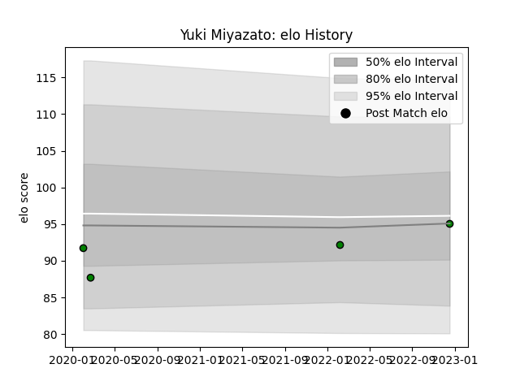

---  
layout: page  
title: Yuki Miyazato  
date: 2023-03-17 17:42:27.422465  
categories: player  
---
# Yuki Miyazato

## Positions: H

## Current elo: 78.0

## Current Percentile: 10.0

# Elo History

# Match History

| Team                 |   Appearances |   Win Rate |
|:---------------------|--------------:|-----------:|
| Mitsubishi Dynaboars |            18 |   0.416667 |

| Opponent                          |   Matches |   Win Rate |
|:----------------------------------|----------:|-----------:|
| Green Rockets Tokatsu             |         2 |       0.5  |
| Saitama Wild Knights              |         2 |       0    |
| Shizuoka Blue Revs                |         2 |       0.25 |
| Toshiba Brave Lupus Tokyo         |         2 |       0.5  |
| Black Rams Tokyo                  |         1 |       1    |
| Hanazono Kintetsu Liners          |         1 |       1    |
| Kamaishi Seawaves                 |         1 |       1    |
| Kobelco Kobe Steelers             |         1 |       0    |
| Kubota Spears Funabashi Tokyo-Bay |         1 |       0    |
| Mie Honda Heat                    |         1 |       0    |
| NTT Docomo Red Hurricanes Osaka   |         1 |       0    |
| Skyactivs Hiroshima               |         1 |       1    |
| Toyota Verblitz                   |         1 |       1    |
| Yokohama Canon Eagles             |         1 |       0    |