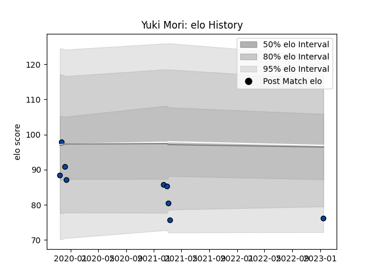

---  
layout: page  
title: Yuki Mori  
date: 2023-01-17 11:30:38.347458  
categories: player  
---
# Yuki Mori

## Positions: SH

## Current elo: 76.0

## Current Percentile: None

# Elo History

# Match History

| Team                |   Appearances |   Win Rate |
|:--------------------|--------------:|-----------:|
| Skyactivs Hiroshima |             5 |       0.2  |
| Mazda Blue Zoomers  |             4 |       0.25 |

| Opponent                         |   Matches |   Win Rate |
|:---------------------------------|----------:|-----------:|
| Coca-Cola Red Sparks             |         2 |          0 |
| Toyota Industries Shuttles Aichi |         2 |          0 |
| Chugoku Red Regulions            |         1 |          1 |
| Hanazono Kintetsu Liners         |         1 |          0 |
| Kyuden Voltex                    |         1 |          0 |
| NTT Docomo Red Hurricanes Osaka  |         1 |          0 |
| Shimizu Blue Sharks              |         1 |          1 |