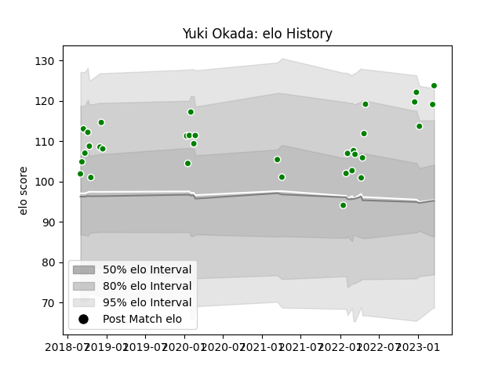

---  
layout: page  
title: Yuki Okada  
date: 2022-12-18 16:40:09.445968  
categories: player  
---
# Yuki Okada

## Positions: W, C

## Current elo: 93.0

## Current Percentile: 33.0

# Elo History

# Match History

| Team            |   Appearances |   Win Rate |
|:----------------|--------------:|-----------:|
| Toyota Verblitz |            17 |   0.588235 |

| Opponent                          |   Matches |   Win Rate |
|:----------------------------------|----------:|-----------:|
| Shizuoka Blue Revs                |         3 |   0.666667 |
| Black Rams Tokyo                  |         2 |   1        |
| Kubota Spears Funabashi Tokyo-Bay |         2 |   0.5      |
| Saitama Wild Knights              |         2 |   0        |
| Tokyo Sungoliath                  |         2 |   0        |
| Toshiba Brave Lupus Tokyo         |         2 |   0.5      |
| Hino Red Dolphins                 |         1 |   1        |
| Mie Honda Heat                    |         1 |   1        |
| NTT Docomo Red Hurricanes Osaka   |         1 |   1        |
| Urayasu D-Rocks                   |         1 |   1        |