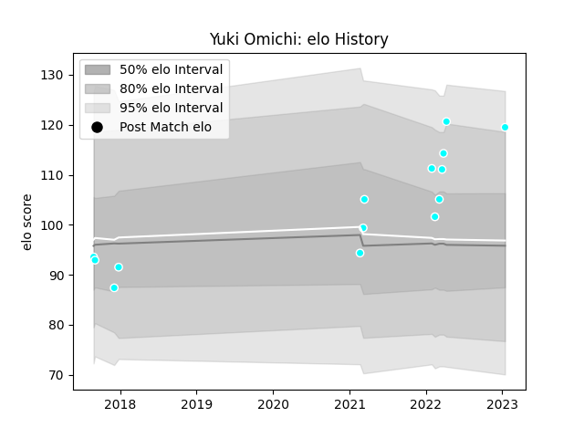

---  
layout: page  
title: Yuki Omichi  
date: 2023-03-21 18:10:23.568537  
categories: player  
---
# Yuki Omichi

Last updated: 2023-03-21
## Positions: W, FB

## Current elo: 143.0

## Current Percentile: 99.0

# Elo History

# Match History

| Team                             |   Appearances |   Win Rate |
|:---------------------------------|--------------:|-----------:|
| Toyota Industries Shuttles Aichi |            25 |       0.64 |

| Opponent                          |   Matches |   Win Rate |
|:----------------------------------|----------:|-----------:|
| Chugoku Red Regulions             |         3 |   1        |
| Green Rockets Tokatsu             |         3 |   0.333333 |
| Hanazono Kintetsu Liners          |         2 |   0.5      |
| Kyuden Voltex                     |         2 |   1        |
| Mie Honda Heat                    |         2 |   0        |
| Munakata Sanix Blues              |         2 |   1        |
| Shimizu Blue Sharks               |         2 |   1        |
| Coca-Cola Red Sparks              |         1 |   1        |
| Hino Red Dolphins                 |         1 |   1        |
| Kamaishi Seawaves                 |         1 |   1        |
| Kubota Spears Funabashi Tokyo-Bay |         1 |   0        |
| Kurita Water Gush                 |         1 |   1        |
| Shizuoka Blue Revs                |         1 |   0        |
| Skyactivs Hiroshima               |         1 |   1        |
| Urayasu D-Rocks                   |         1 |   0        |
| Yokohama Canon Eagles             |         1 |   0        |