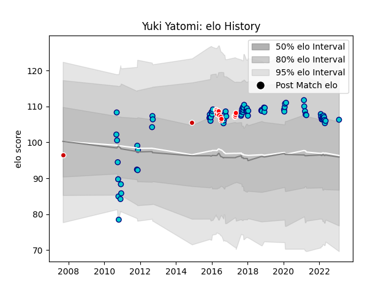

---  
layout: page  
title: Yuki Yatomi  
date: 2023-02-09 13:57:20.166448  
categories: player  
---
# Yuki Yatomi

## Positions: SH

## Country: Japan

## Current elo: 106.0

## Current Percentile: 75.0

# Elo History

# Match History

| Team               |   Appearances |   Win Rate |
|:-------------------|--------------:|-----------:|
| Shizuoka Blue Revs |            76 |   0.644737 |
| Sunwolves          |            15 |   0.1      |
| Japan              |             2 |   0        |

| Opponent                          |   Matches |   Win Rate |
|:----------------------------------|----------:|-----------:|
| Toyota Verblitz                   |         8 |   0.75     |
| Urayasu D-Rocks                   |         7 |   1        |
| Toshiba Brave Lupus Tokyo         |         7 |   0.285714 |
| Black Rams Tokyo                  |         7 |   0.857143 |
| Yokohama Canon Eagles             |         6 |   0.666667 |
| Tokyo Sungoliath                  |         6 |   0        |
| Saitama Wild Knights              |         5 |   0.2      |
| Kobelco Kobe Steelers             |         5 |   0.2      |
| Green Rockets Tokatsu             |         4 |   1        |
| Kubota Spears Funabashi Tokyo-Bay |         4 |   0.75     |
| Hanazono Kintetsu Liners          |         3 |   0.666667 |
| Bulls                             |         3 |   0.333333 |
| Munakata Sanix Blues              |         3 |   1        |
| NTT Docomo Red Hurricanes Osaka   |         3 |   1        |
| Coca-Cola Red Sparks              |         3 |   0.666667 |
| Hino Red Dolphins                 |         2 |   1        |
| Toyota Industries Shuttles Aichi  |         2 |   1        |
| Stormers                          |         2 |   0.25     |
| Southern Kings                    |         1 |   0        |
| Brumbies                          |         1 |   0        |
| Cheetahs                          |         1 |   0        |
| Chiefs                            |         1 |   0        |
| Queensland Reds                   |         1 |   0        |
| Sharks                            |         1 |   0        |
| Highlanders                       |         1 |   0        |
| New South Wales Waratahs          |         1 |   0        |
| Mitsubishi Dynaboars              |         1 |   1        |
| Crusaders                         |         1 |   0        |
| Georgia                           |         1 |   0        |
| Jaguares                          |         1 |   0        |
| Australia                         |         1 |   0        |