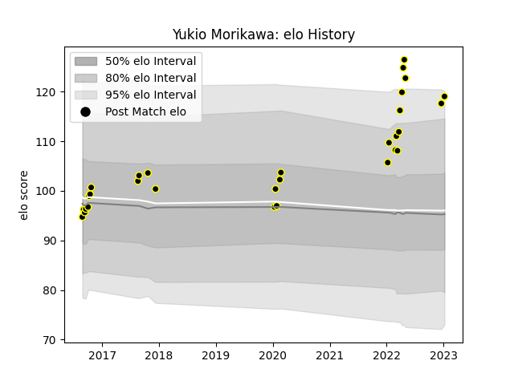

---  
layout: page  
title: Yukio Morikawa  
date: 2023-01-13 11:35:22.132116  
categories: player  
---
# Yukio Morikawa

## Positions: P

## Current elo: 119.0

## Current Percentile: 93.0

# Elo History

# Match History

| Team             |   Appearances |   Win Rate |
|:-----------------|--------------:|-----------:|
| Tokyo Sungoliath |            30 |        0.8 |

| Opponent                          |   Matches |   Win Rate |
|:----------------------------------|----------:|-----------:|
| Yokohama Canon Eagles             |         4 |   1        |
| Black Rams Tokyo                  |         3 |   1        |
| Saitama Wild Knights              |         3 |   0.333333 |
| Toshiba Brave Lupus Tokyo         |         3 |   0.333333 |
| Green Rockets Tokatsu             |         2 |   1        |
| Kobelco Kobe Steelers             |         2 |   0.5      |
| Kubota Spears Funabashi Tokyo-Bay |         2 |   0.5      |
| Toyota Verblitz                   |         2 |   1        |
| Urayasu D-Rocks                   |         2 |   1        |
| Hanazono Kintetsu Liners          |         1 |   1        |
| Hino Red Dolphins                 |         1 |   1        |
| Mie Honda Heat                    |         1 |   1        |
| Munakata Sanix Blues              |         1 |   1        |
| NTT Docomo Red Hurricanes Osaka   |         1 |   1        |
| Shizuoka Blue Revs                |         1 |   1        |
| Toyota Industries Shuttles Aichi  |         1 |   1        |