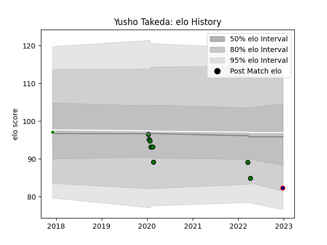

---  
layout: page  
title: Yusho Takeda  
date: 2022-12-28 12:58:24.233865  
categories: player  
---
# Yusho Takeda

## Positions: C, FB

## Current elo: 82.0

## Current Percentile: 13.0

# Elo History

# Match History

| Team                     |   Appearances |   Win Rate |
|:-------------------------|--------------:|-----------:|
| Mitsubishi Dynaboars     |             8 |       0.25 |
| Hanazono Kintetsu Liners |             1 |       0    |
| Toyota Verblitz          |             1 |       1    |

| Opponent                        |   Matches |   Win Rate |
|:--------------------------------|----------:|-----------:|
| Coca-Cola Red Sparks            |         1 |          1 |
| Green Rockets Tokatsu           |         1 |          1 |
| Hino Red Dolphins               |         1 |          1 |
| Kobelco Kobe Steelers           |         1 |          0 |
| Mie Honda Heat                  |         1 |          0 |
| NTT Docomo Red Hurricanes Osaka |         1 |          0 |
| Saitama Wild Knights            |         1 |          0 |
| Shizuoka Blue Revs              |         1 |          0 |
| Toshiba Brave Lupus Tokyo       |         1 |          0 |
| Yokohama Canon Eagles           |         1 |          0 |