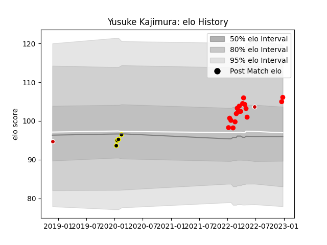

---  
layout: page  
title: Yusuke Kajimura  
date: 2023-03-21 18:21:15.965712  
categories: player  
---
# Yusuke Kajimura

Last updated: 2023-03-21
## Positions: C

## Country: Japan

## Current elo: 80.0

## Current Percentile: 10.0

# Elo History

# Match History

| Team                  |   Appearances |   Win Rate |
|:----------------------|--------------:|-----------:|
| Tokyo Sungoliath      |            15 |   0.666667 |
| Yokohama Canon Eagles |            15 |   0.6      |
| Japan                 |             2 |   1        |

| Opponent                          |   Matches |   Win Rate |
|:----------------------------------|----------:|-----------:|
| Kobelco Kobe Steelers             |         5 |   0.2      |
| Toyota Verblitz                   |         4 |   1        |
| Urayasu D-Rocks                   |         4 |   1        |
| Kubota Spears Funabashi Tokyo-Bay |         3 |   0.666667 |
| Saitama Wild Knights              |         3 |   0        |
| Green Rockets Tokatsu             |         2 |   1        |
| Shizuoka Blue Revs                |         2 |   1        |
| Toshiba Brave Lupus Tokyo         |         2 |   0        |
| Black Rams Tokyo                  |         1 |   1        |
| Munakata Sanix Blues              |         1 |   1        |
| NTT Docomo Red Hurricanes Osaka   |         1 |   1        |
| Russia                            |         1 |   1        |
| Tokyo Sungoliath                  |         1 |   0        |
| Toyota Industries Shuttles Aichi  |         1 |   1        |
| Uruguay                           |         1 |   1        |