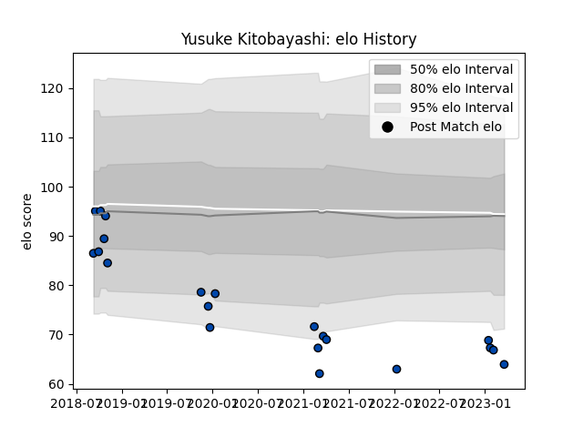

---  
layout: page  
title: Yusuke Kitobayashi  
date: 2023-01-17 11:34:05.919005  
categories: player  
---
# Yusuke Kitobayashi

## Positions: H

## Current elo: 63.0

## Current Percentile: None

# Elo History

# Match History

| Team                |   Appearances |   Win Rate |
|:--------------------|--------------:|-----------:|
| Mazda Blue Zoomers  |            11 |   0.181818 |
| Skyactivs Hiroshima |             5 |   0.2      |

| Opponent                         |   Matches |   Win Rate |
|:---------------------------------|----------:|-----------:|
| Chugoku Red Regulions            |         2 |        0.5 |
| Coca-Cola Red Sparks             |         2 |        0   |
| Kamaishi Seawaves                |         2 |        0.5 |
| Kurita Water Gush                |         2 |        0   |
| Kyuden Voltex                    |         2 |        0.5 |
| NTT Docomo Red Hurricanes Osaka  |         2 |        0   |
| Hanazono Kintetsu Liners         |         1 |        0   |
| Hino Red Dolphins                |         1 |        0   |
| Mitsubishi Dynaboars             |         1 |        0   |
| Toyota Industries Shuttles Aichi |         1 |        0   |