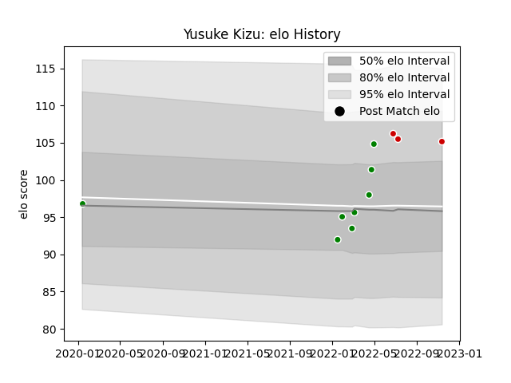

---  
layout: page  
title: Yusuke Kizu  
date: 2022-11-15 23:41:02.536798  
categories: player  
---
# Yusuke Kizu

## Positions: P

## Country: Japan

## Current elo: 105.0

## Current Percentile: 84.0

# Elo History

# Match History

| Team            |   Appearances |   Win Rate |
|:----------------|--------------:|-----------:|
| Toyota Verblitz |             8 |   0.625    |
| Japan           |             3 |   0.333333 |

| Opponent                          |   Matches |   Win Rate |
|:----------------------------------|----------:|-----------:|
| Shizuoka Blue Revs                |         2 |        0.5 |
| Black Rams Tokyo                  |         1 |        1   |
| England                           |         1 |        0   |
| France                            |         1 |        0   |
| Kubota Spears Funabashi Tokyo-Bay |         1 |        0   |
| NTT Docomo Red Hurricanes Osaka   |         1 |        1   |
| Tokyo Sungoliath                  |         1 |        0   |
| Toshiba Brave Lupus Tokyo         |         1 |        1   |
| Urayasu D-Rocks                   |         1 |        1   |
| Uruguay                           |         1 |        1   |