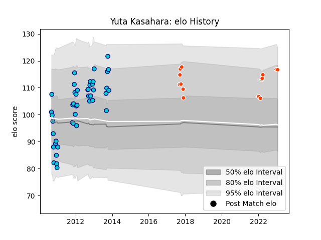

---  
layout: page  
title: Yuta Kasahara  
date: 2022-12-28 12:55:38.825807  
categories: player  
---
# Yuta Kasahara

## Positions: L

## Current elo: 114.0

## Current Percentile: None

# Elo History

# Match History

| Team               |   Appearances |   Win Rate |
|:-------------------|--------------:|-----------:|
| Shizuoka Blue Revs |            45 |   0.533333 |
| Hino Red Dolphins  |            13 |   0.615385 |

| Opponent                          |   Matches |   Win Rate |
|:----------------------------------|----------:|-----------:|
| Hanazono Kintetsu Liners          |         6 |   0.333333 |
| Black Rams Tokyo                  |         4 |   0.75     |
| Toshiba Brave Lupus Tokyo         |         4 |   0.25     |
| Saitama Wild Knights              |         4 |   0.125    |
| Urayasu D-Rocks                   |         3 |   0.666667 |
| Coca-Cola Red Sparks              |         3 |   0.666667 |
| Green Rockets Tokatsu             |         3 |   0.666667 |
| Toyota Verblitz                   |         3 |   0.333333 |
| Kobelco Kobe Steelers             |         3 |   0.166667 |
| Tokyo Sungoliath                  |         3 |   0        |
| Munakata Sanix Blues              |         2 |   1        |
| Toyota Industries Shuttles Aichi  |         2 |   0.5      |
| NTT Docomo Red Hurricanes Osaka   |         2 |   1        |
| Mie Honda Heat                    |         2 |   0.5      |
| Mitsubishi Dynaboars              |         2 |   0.5      |
| Kyuden Voltex                     |         2 |   1        |
| Kubota Spears Funabashi Tokyo-Bay |         2 |   1        |
| Kamaishi Seawaves                 |         2 |   1        |
| Yokohama Canon Eagles             |         2 |   0.5      |
| Chubu Electric Power              |         1 |   1        |
| Skyactivs Hiroshima               |         1 |   1        |
| Mazda Blue Zoomers                |         1 |   1        |
| Chugoku Red Regulions             |         1 |   1        |