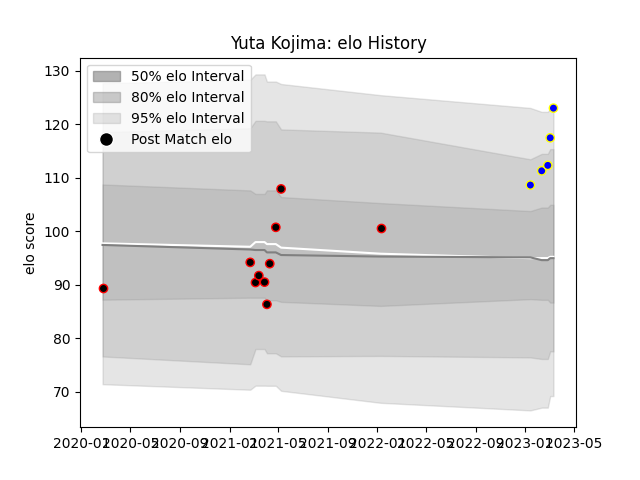

---  
layout: page  
title: Yuta Kojima  
date: 2023-01-15 11:58:02.880511  
categories: player  
---
# Yuta Kojima

## Positions: L, N8

## Current elo: 105.0

## Current Percentile: None

# Elo History

# Match History

| Team                            |   Appearances |   Win Rate |
|:--------------------------------|--------------:|-----------:|
| NTT Docomo Red Hurricanes Osaka |             8 |      0.375 |
| Urayasu D-Rocks                 |             1 |      1     |

| Opponent                         |   Matches |   Win Rate |
|:---------------------------------|----------:|-----------:|
| Black Rams Tokyo                 |         2 |        0.5 |
| Saitama Wild Knights             |         2 |        0   |
| Hino Red Dolphins                |         1 |        1   |
| Kobelco Kobe Steelers            |         1 |        0   |
| Shizuoka Blue Revs               |         1 |        0   |
| Toyota Industries Shuttles Aichi |         1 |        1   |
| Yokohama Canon Eagles            |         1 |        1   |