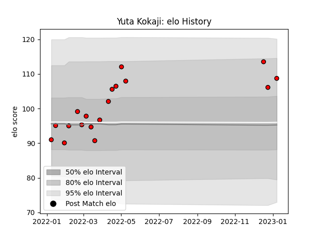

---  
layout: page  
title: Yuta Kokaji  
date: 2022-12-31 16:27:15.112686  
categories: player  
---
# Yuta Kokaji

## Positions: P

## Current elo: 105.0

## Current Percentile: 89.0

# Elo History

# Match History

| Team                      |   Appearances |   Win Rate |
|:--------------------------|--------------:|-----------:|
| Toshiba Brave Lupus Tokyo |            17 |   0.647059 |

| Opponent                          |   Matches |   Win Rate |
|:----------------------------------|----------:|-----------:|
| Black Rams Tokyo                  |         2 |        1   |
| NTT Docomo Red Hurricanes Osaka   |         2 |        1   |
| Saitama Wild Knights              |         2 |        0   |
| Shizuoka Blue Revs                |         2 |        1   |
| Tokyo Sungoliath                  |         2 |        0.5 |
| Toyota Verblitz                   |         2 |        0.5 |
| Green Rockets Tokatsu             |         1 |        1   |
| Kobelco Kobe Steelers             |         1 |        1   |
| Kubota Spears Funabashi Tokyo-Bay |         1 |        0   |
| Urayasu D-Rocks                   |         1 |        0   |
| Yokohama Canon Eagles             |         1 |        1   |