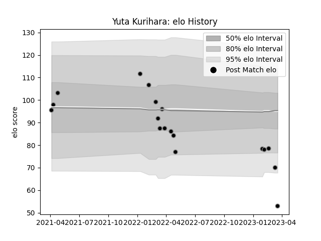

---  
layout: page  
title: Yuta Kurihara  
date: 2023-01-30 17:54:30.816815  
categories: player  
---
# Yuta Kurihara

## Positions: W

## Current elo: 81.0

## Current Percentile: 12.0

# Elo History

# Match History

| Team             |   Appearances |   Win Rate |
|:-----------------|--------------:|-----------:|
| Black Rams Tokyo |            13 |   0.307692 |

| Opponent                          |   Matches |   Win Rate |
|:----------------------------------|----------:|-----------:|
| Green Rockets Tokatsu             |         2 |          1 |
| Toyota Verblitz                   |         2 |          0 |
| Hino Red Dolphins                 |         1 |          1 |
| Kobelco Kobe Steelers             |         1 |          0 |
| Kubota Spears Funabashi Tokyo-Bay |         1 |          0 |
| NTT Docomo Red Hurricanes Osaka   |         1 |          1 |
| Saitama Wild Knights              |         1 |          0 |
| Tokyo Sungoliath                  |         1 |          0 |
| Toshiba Brave Lupus Tokyo         |         1 |          0 |
| Urayasu D-Rocks                   |         1 |          0 |
| Yokohama Canon Eagles             |         1 |          0 |