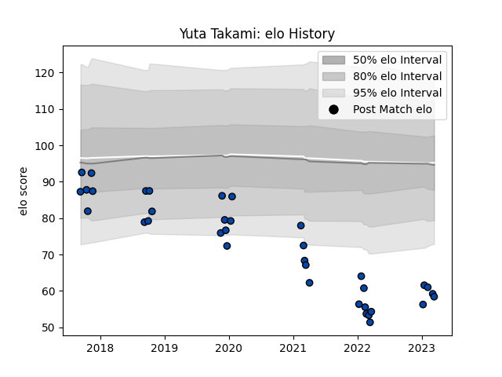

---  
layout: page  
title: Yuta Takami  
date: 2023-03-21 18:43:09.501250  
categories: player  
---
# Yuta Takami

Last updated: 2023-03-21
## Positions: P, H

## Current elo: 58.0

## Current Percentile: 2.0

# Elo History

# Match History

| Team                |   Appearances |   Win Rate |
|:--------------------|--------------:|-----------:|
| Mazda Blue Zoomers  |            18 |   0.305556 |
| Skyactivs Hiroshima |            18 |   0.166667 |

| Opponent                         |   Matches |   Win Rate |
|:---------------------------------|----------:|-----------:|
| Kamaishi Seawaves                |         5 |        0.5 |
| Kyuden Voltex                    |         5 |        0.2 |
| Hanazono Kintetsu Liners         |         4 |        0   |
| Chugoku Red Regulions            |         3 |        1   |
| Kurita Water Gush                |         3 |        0   |
| Mie Honda Heat                   |         3 |        0   |
| Mitsubishi Dynaboars             |         3 |        0   |
| NTT Docomo Red Hurricanes Osaka  |         3 |        0   |
| Coca-Cola Red Sparks             |         2 |        0   |
| Toyota Industries Shuttles Aichi |         2 |        0   |
| Chubu Electric Power             |         1 |        1   |
| Hino Red Dolphins                |         1 |        0   |
| Shimizu Blue Sharks              |         1 |        1   |