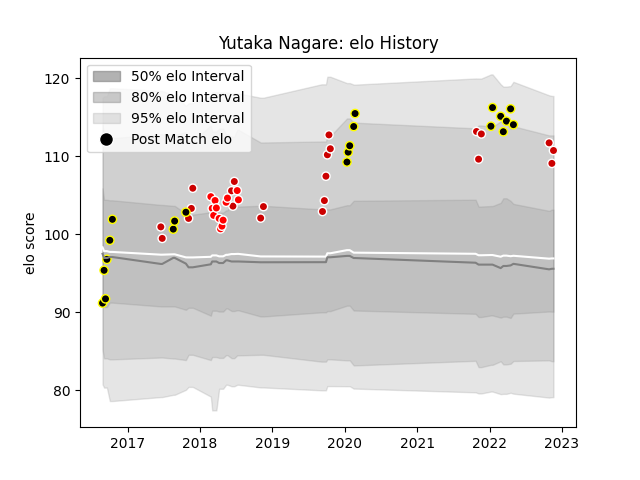

---  
layout: page  
title: Yutaka Nagare  
date: 2023-03-20 15:45:15.176574  
categories: player  
---
# Yutaka Nagare

Last updated: 2023-03-20
## Positions: SH

## Country: Japan

## Current elo: 98.0

## Current Percentile: 64.0

# Elo History

# Match History

| Team             |   Appearances |   Win Rate |
|:-----------------|--------------:|-----------:|
| Tokyo Sungoliath |            56 |   0.821429 |
| Japan            |            23 |   0.369565 |
| Sunwolves        |            13 |   0.153846 |

| Opponent                          |   Matches |   Win Rate |
|:----------------------------------|----------:|-----------:|
| Saitama Wild Knights              |         7 |   0.285714 |
| Toshiba Brave Lupus Tokyo         |         6 |   0.666667 |
| Green Rockets Tokatsu             |         5 |   1        |
| Toyota Verblitz                   |         5 |   1        |
| Kobelco Kobe Steelers             |         5 |   0.4      |
| Kubota Spears Funabashi Tokyo-Bay |         4 |   1        |
| Ireland                           |         4 |   0.25     |
| Munakata Sanix Blues              |         4 |   1        |
| Shizuoka Blue Revs                |         4 |   1        |
| Urayasu D-Rocks                   |         4 |   1        |
| Yokohama Canon Eagles             |         3 |   1        |
| Scotland                          |         2 |   0.5      |
| Black Rams Tokyo                  |         2 |   1        |
| Russia                            |         2 |   1        |
| Queensland Reds                   |         2 |   0.5      |
| New Zealand                       |         2 |   0        |
| New South Wales Waratahs          |         2 |   0        |
| South Africa                      |         2 |   0        |
| NTT Docomo Red Hurricanes Osaka   |         2 |   1        |
| Australia                         |         2 |   0        |
| England                           |         2 |   0        |
| Italy                             |         2 |   0.5      |
| France                            |         2 |   0.25     |
| Mie Honda Heat                    |         1 |   1        |
| Blues                             |         1 |   0        |
| Brumbies                          |         1 |   0        |
| Toyota Industries Shuttles Aichi  |         1 |   1        |
| Chiefs                            |         1 |   0        |
| Tonga                             |         1 |   1        |
| Stormers                          |         1 |   1        |
| Crusaders                         |         1 |   0        |
| Sharks                            |         1 |   0        |
| Melbourne Rebels                  |         1 |   0        |
| Samoa                             |         1 |   1        |
| Georgia                           |         1 |   1        |
| Hanazono Kintetsu Liners          |         1 |   1        |
| Hino Red Dolphins                 |         1 |   1        |
| Hurricanes                        |         1 |   0        |
| Lions                             |         1 |   0        |
| Mitsubishi Dynaboars              |         1 |   1        |