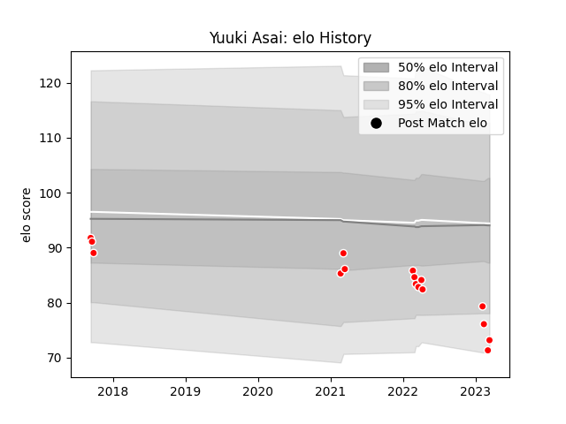

---  
layout: page  
title: Yuuki Asai  
date: 2023-03-21 18:52:16.578132  
categories: player  
---
# Yuuki Asai

Last updated: 2023-03-21
## Positions: H

## Current elo: 73.0

## Current Percentile: 5.0

# Elo History

# Match History

| Team                  |   Appearances |   Win Rate |
|:----------------------|--------------:|-----------:|
| Chugoku Red Regulions |            16 |     0.0625 |

| Opponent                         |   Matches |   Win Rate |
|:---------------------------------|----------:|-----------:|
| Kyuden Voltex                    |         4 |        0   |
| Kurita Water Gush                |         2 |        0.5 |
| Shimizu Blue Sharks              |         2 |        0   |
| Skyactivs Hiroshima              |         2 |        0   |
| Toyota Industries Shuttles Aichi |         2 |        0   |
| Hino Red Dolphins                |         1 |        0   |
| Mie Honda Heat                   |         1 |        0   |
| Munakata Sanix Blues             |         1 |        0   |
| NTT Docomo Red Hurricanes Osaka  |         1 |        0   |