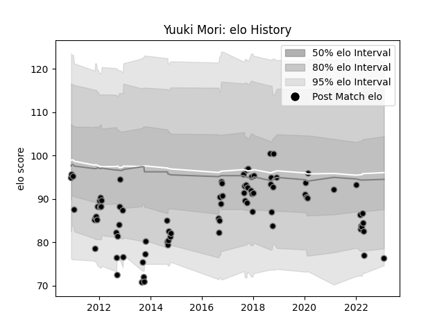

---  
layout: page  
title: Yuuki Mori  
date: 2023-02-04 18:26:56.298840  
categories: player  
---
# Yuuki Mori

## Positions: H

## Current elo: 76.0

## Current Percentile: 7.0

# Elo History

# Match History

| Team             |   Appearances |   Win Rate |
|:-----------------|--------------:|-----------:|
| Black Rams Tokyo |            84 |   0.428571 |

| Opponent                          |   Matches |   Win Rate |
|:----------------------------------|----------:|-----------:|
| Kobelco Kobe Steelers             |        10 |   0.2      |
| Yokohama Canon Eagles             |         7 |   0.714286 |
| Saitama Wild Knights              |         7 |   0.142857 |
| Green Rockets Tokatsu             |         7 |   0.857143 |
| Urayasu D-Rocks                   |         6 |   0.25     |
| Toshiba Brave Lupus Tokyo         |         6 |   0.333333 |
| Tokyo Sungoliath                  |         6 |   0        |
| Shizuoka Blue Revs                |         6 |   0.166667 |
| Toyota Verblitz                   |         5 |   0.2      |
| Coca-Cola Red Sparks              |         5 |   0.9      |
| Hanazono Kintetsu Liners          |         5 |   0.4      |
| NTT Docomo Red Hurricanes Osaka   |         4 |   1        |
| Munakata Sanix Blues              |         3 |   1        |
| Mie Honda Heat                    |         3 |   0.666667 |
| Kubota Spears Funabashi Tokyo-Bay |         2 |   0        |
| Kyuden Voltex                     |         1 |   0        |
| Toyota Industries Shuttles Aichi  |         1 |   1        |