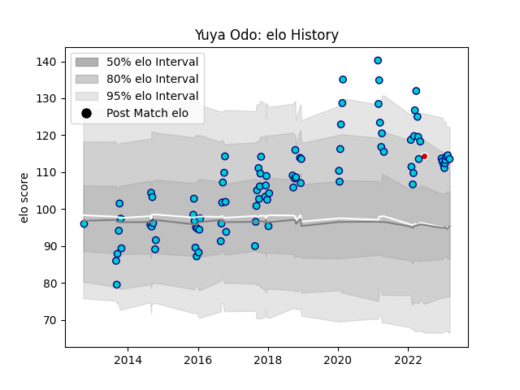

---  
layout: page  
title: Yuya Odo  
date: 2023-01-13 11:26:03.685771  
categories: player  
---
# Yuya Odo

## Positions: L

## Country: Japan

## Current elo: 111.0

## Current Percentile: 83.0

# Elo History

# Match History

| Team               |   Appearances |   Win Rate |
|:-------------------|--------------:|-----------:|
| Shizuoka Blue Revs |            64 |   0.679688 |
| Japan              |             1 |   1        |

| Opponent                          |   Matches |   Win Rate |
|:----------------------------------|----------:|-----------:|
| Black Rams Tokyo                  |         7 |   0.857143 |
| Toshiba Brave Lupus Tokyo         |         7 |   0.428571 |
| Yokohama Canon Eagles             |         7 |   0.571429 |
| Saitama Wild Knights              |         6 |   0.25     |
| Kobelco Kobe Steelers             |         4 |   0        |
| NTT Docomo Red Hurricanes Osaka   |         4 |   1        |
| Green Rockets Tokatsu             |         4 |   1        |
| Toyota Verblitz                   |         4 |   0.5      |
| Kubota Spears Funabashi Tokyo-Bay |         3 |   0.666667 |
| Coca-Cola Red Sparks              |         3 |   1        |
| Urayasu D-Rocks                   |         3 |   1        |
| Munakata Sanix Blues              |         3 |   1        |
| Hino Red Dolphins                 |         2 |   1        |
| Mie Honda Heat                    |         2 |   1        |
| Toyota Industries Shuttles Aichi  |         2 |   1        |
| Hanazono Kintetsu Liners          |         1 |   1        |
| Mitsubishi Dynaboars              |         1 |   1        |
| Tokyo Sungoliath                  |         1 |   0        |
| Uruguay                           |         1 |   1        |