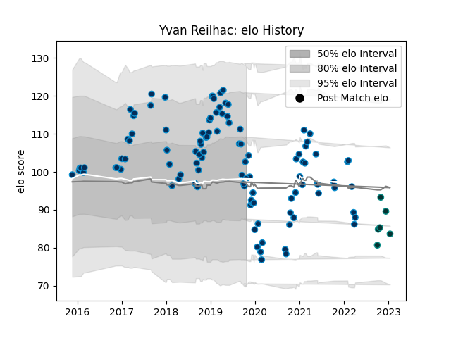

---  
layout: page  
title: Yvan Reilhac  
date: 2022-12-14 11:18:30.886188  
categories: player  
---
# Yvan Reilhac

## Positions: C, W

## Current elo: 102.0

## Current Percentile: 78.0

# Elo History

# Match History

| Team                |   Appearances |   Win Rate |
|:--------------------|--------------:|-----------:|
| Montpellier Herault |           103 |        0.5 |
| Pau                 |             5 |        0.2 |

| Opponent             |   Matches |   Win Rate |
|:---------------------|----------:|-----------:|
| Stade Toulousain     |        10 |   0.4      |
| Pau                  |        10 |   0.5      |
| Clermont Auvergne    |         9 |   0.666667 |
| Lyon                 |         8 |   0.375    |
| Toulon               |         7 |   0.5      |
| La Rochelle          |         7 |   0.571429 |
| Stade Francais Paris |         7 |   0.5      |
| Castres Olympique    |         7 |   0.142857 |
| Racing 92            |         6 |   0        |
| Agen                 |         6 |   0.833333 |
| Bayonne              |         5 |   0.6      |
| Bordeaux Begles      |         4 |   0.125    |
| Perpignan            |         3 |   0.666667 |
| Brive                |         3 |   0.333333 |
| Edinburgh            |         2 |   0.5      |
| Connacht             |         2 |   0.5      |
| Newcastle Falcons    |         2 |   0.5      |
| Oyonnax              |         2 |   1        |
| Calvisano            |         2 |   1        |
| Grenoble             |         2 |   0.5      |
| Gloucester Rugby     |         1 |   1        |
| Harlequins           |         1 |   1        |
| Cheetahs             |         1 |   0        |
| Biarritz Olympique   |         1 |   1        |