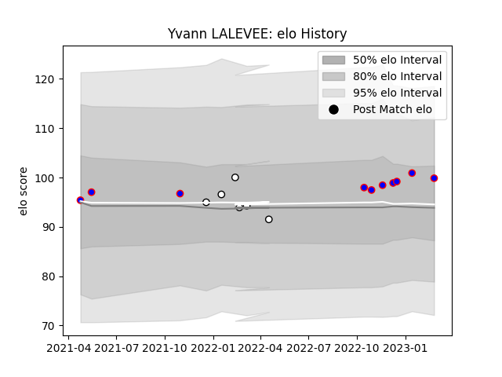

---  
layout: page  
title: Yvann LALEVEE  
date: 2023-02-26 11:19:10.089168  
categories: player  
---
# Yvann LALEVEE

## Positions: H

## Current elo: 100.0

## Current Percentile: None

# Elo History

# Match History

| Team                       |   Appearances |   Win Rate |
|:---------------------------|--------------:|-----------:|
| Beziers                    |            10 |        0.4 |
| Valence Romans Drome Rugby |             6 |        0.5 |

| Opponent                   |   Matches |   Win Rate |
|:---------------------------|----------:|-----------:|
| Aurillac                   |         2 |        0.5 |
| Massy                      |         2 |        0.5 |
| Tarbes                     |         2 |        0.5 |
| Agen                       |         1 |        1   |
| Biarritz Olympique         |         1 |        1   |
| Blagnac                    |         1 |        0   |
| Carcassonne                |         1 |        0   |
| Cognac Saint Jean d'Angély |         1 |        1   |
| Grenoble                   |         1 |        0   |
| Nevers                     |         1 |        0   |
| Oyonnax                    |         1 |        0   |
| Suresnes                   |         1 |        1   |
| Vannes                     |         1 |        0   |