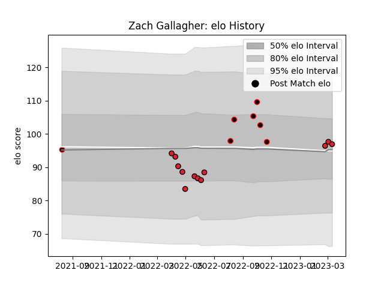

---  
layout: page  
title: Zach Gallagher  
date: 2023-03-17 17:41:02.895483  
categories: player  
---
# Zach Gallagher

## Positions: L

## Current elo: 97.0

## Current Percentile: 57.0

# Elo History

# Match History

| Team       |   Appearances |   Win Rate |
|:-----------|--------------:|-----------:|
| Crusaders  |            12 |   0.666667 |
| Canterbury |             7 |   0.714286 |

| Opponent                 |   Matches |   Win Rate |
|:-------------------------|----------:|-----------:|
| Auckland                 |         2 |        0.5 |
| Chiefs                   |         2 |        0.5 |
| Fijian Drua              |         2 |        0.5 |
| Highlanders              |         2 |        1   |
| Queensland Reds          |         2 |        1   |
| Wellington               |         2 |        0.5 |
| Blues                    |         1 |        0   |
| Hurricanes               |         1 |        1   |
| Manawatu                 |         1 |        1   |
| Melbourne Rebels         |         1 |        1   |
| New South Wales Waratahs |         1 |        0   |
| Northland                |         1 |        1   |
| Otago                    |         1 |        1   |