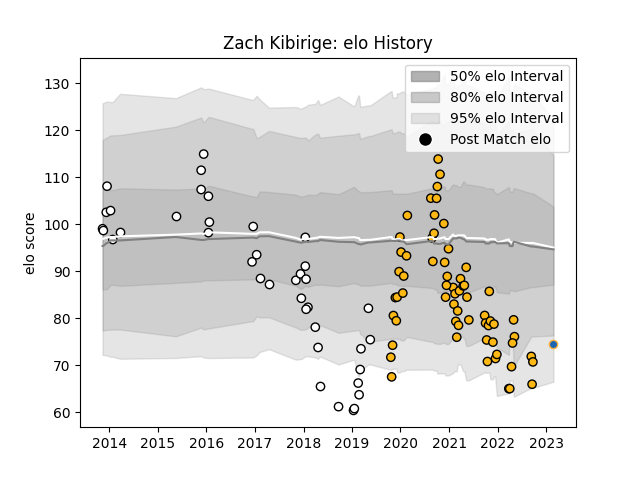

---  
layout: page  
title: Zach Kibirige  
date: 2023-03-17 17:27:26.309943  
categories: player  
---
# Zach Kibirige

## Positions: W

## Current elo: 67.0

## Current Percentile: 8.0

# Elo History

# Match History

| Team              |   Appearances |   Win Rate |
|:------------------|--------------:|-----------:|
| Wasps             |            63 |   0.484127 |
| Newcastle Falcons |            39 |   0.512821 |
| Western Force     |             2 |   0.5      |

| Opponent               |   Matches |   Win Rate |
|:-----------------------|----------:|-----------:|
| Gloucester Rugby       |        11 |   0.181818 |
| Bristol Rugby          |         8 |   0.625    |
| Exeter Chiefs          |         7 |   0.142857 |
| Bath Rugby             |         7 |   0.857143 |
| Worcester Warriors     |         6 |   0.833333 |
| Harlequins             |         6 |   0.333333 |
| Northampton Saints     |         5 |   0.4      |
| London Irish           |         5 |   0.5      |
| Sale Sharks            |         4 |   0.25     |
| RC Enisei              |         4 |   0.75     |
| Newcastle Falcons      |         4 |   0.5      |
| Leicester Tigers       |         4 |   0.25     |
| Enisey-STM Krasnoyarsk |         4 |   0.75     |
| Wasps                  |         3 |   0.666667 |
| Saracens               |         3 |   0.333333 |
| Brive                  |         3 |   0.666667 |
| Montpellier Herault    |         2 |   0.5      |
| Bordeaux Begles        |         2 |   0.5      |
| Calvisano              |         2 |   1        |
| Lyon                   |         2 |   0.5      |
| Dragons                |         2 |   1        |
| Edinburgh              |         2 |   0.5      |
| Melbourne Rebels       |         1 |   1        |
| Munster                |         1 |   0        |
| Grenoble               |         1 |   0        |
| Queensland Reds        |         1 |   0        |
| Connacht               |         1 |   0        |
| Biarritz Olympique     |         1 |   1        |
| Toulon                 |         1 |   0        |
| Agen                   |         1 |   1        |