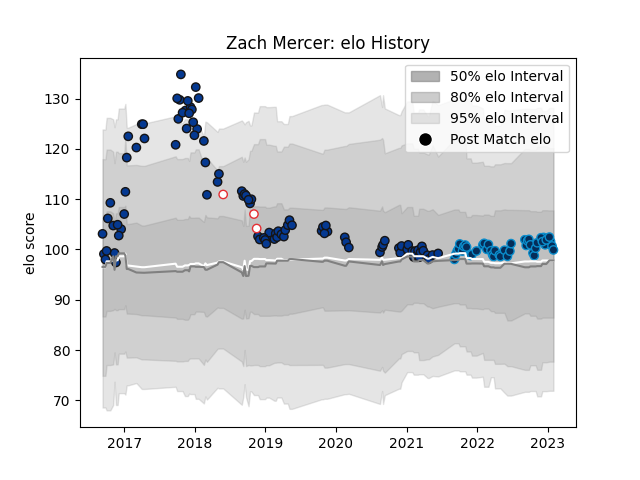

---  
layout: page  
title: Zach Mercer  
date: 2023-01-13 11:30:27.264870  
categories: player  
---
# Zach Mercer

## Positions: N8, FL

## Country: England

## Current elo: 102.0

## Current Percentile: 60.0

# Elo History

# Match History

| Team                |   Appearances |   Win Rate |
|:--------------------|--------------:|-----------:|
| Bath Rugby          |            96 |   0.536458 |
| Montpellier Herault |            41 |   0.658537 |
| England             |             3 |   0.666667 |

| Opponent             |   Matches |   Win Rate |
|:---------------------|----------:|-----------:|
| Wasps                |        11 |   0.409091 |
| Worcester Warriors   |         9 |   0.777778 |
| Exeter Chiefs        |         8 |   0.125    |
| Leicester Tigers     |         8 |   0.625    |
| Newcastle Falcons    |         8 |   0.375    |
| Bristol Rugby        |         7 |   0.571429 |
| Harlequins           |         7 |   0.428571 |
| Sale Sharks          |         7 |   0.5      |
| Northampton Saints   |         6 |   0.833333 |
| Gloucester Rugby     |         6 |   0.583333 |
| Stade Toulousain     |         5 |   0        |
| Toulon               |         5 |   0.7      |
| London Irish         |         5 |   0.8      |
| Brive                |         4 |   0.875    |
| Racing 92            |         4 |   0.75     |
| Pau                  |         4 |   0.75     |
| Stade Francais Paris |         3 |   1        |
| Scarlets             |         3 |   0.333333 |
| Perpignan            |         3 |   1        |
| Lyon                 |         3 |   0.333333 |
| La Rochelle          |         3 |   0.666667 |
| Clermont Auvergne    |         3 |   0        |
| Bordeaux Begles      |         3 |   0.666667 |
| Saracens             |         2 |   1        |
| Castres Olympique    |         2 |   1        |
| Biarritz Olympique   |         2 |   1        |
| Benetton Treviso     |         2 |   1        |
| Ospreys              |         1 |   0        |
| Bayonne              |         1 |   1        |
| Japan                |         1 |   1        |
| South Africa         |         1 |   1        |
| Cardiff Blues        |         1 |   1        |
| Ulster               |         1 |   0        |
| Barbarians           |         1 |   0        |