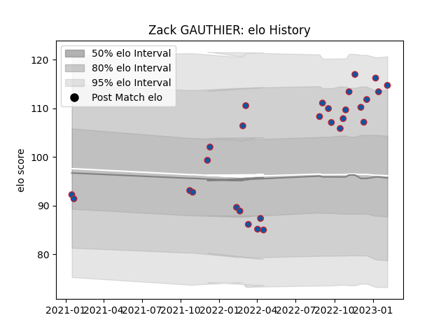

---  
layout: page  
title: Zack GAUTHIER  
date: 2023-02-16 16:39:56.378416  
categories: player  
---
# Zack GAUTHIER

## Positions: P

## Current elo: 117.0

## Current Percentile: 92.0

# Elo History

# Match History

| Team     |   Appearances |   Win Rate |
|:---------|--------------:|-----------:|
| Grenoble |            30 |   0.633333 |

| Opponent           |   Matches |   Win Rate |
|:-------------------|----------:|-----------:|
| Agen               |         3 |   0.666667 |
| Montauban          |         3 |   0.833333 |
| Nevers             |         3 |   0.833333 |
| Provence Rugby     |         3 |   0.166667 |
| Rouen              |         3 |   0.666667 |
| Aurillac           |         2 |   1        |
| Beziers            |         2 |   0.5      |
| Carcassonne        |         2 |   0.75     |
| Colomiers          |         2 |   0        |
| Mont-de-Marsan     |         2 |   0.5      |
| Soyaux-Angouleme   |         2 |   1        |
| Biarritz Olympique |         1 |   0.5      |
| Massy              |         1 |   1        |
| Narbonne           |         1 |   0.5      |