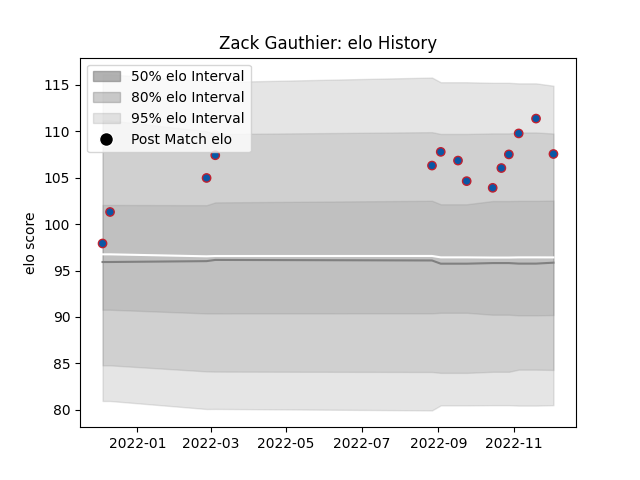

---  
layout: page  
title: Zack Gauthier  
date: 2022-12-18 16:27:37.031339  
categories: player  
---
# Zack Gauthier

## Positions: P

## Current elo: 108.0

## Current Percentile: 82.0

# Elo History

# Match History

| Team     |   Appearances |   Win Rate |
|:---------|--------------:|-----------:|
| Grenoble |            16 |       0.75 |

| Opponent           |   Matches |   Win Rate |
|:-------------------|----------:|-----------:|
| Beziers            |         2 |       0.5  |
| Mont-de-Marsan     |         2 |       0.5  |
| Montauban          |         2 |       0.75 |
| Nevers             |         2 |       1    |
| Agen               |         1 |       1    |
| Aurillac           |         1 |       1    |
| Biarritz Olympique |         1 |       0.5  |
| Carcassonne        |         1 |       1    |
| Massy              |         1 |       1    |
| Provence Rugby     |         1 |       0    |
| Rouen              |         1 |       1    |
| Soyaux-Angouleme   |         1 |       1    |