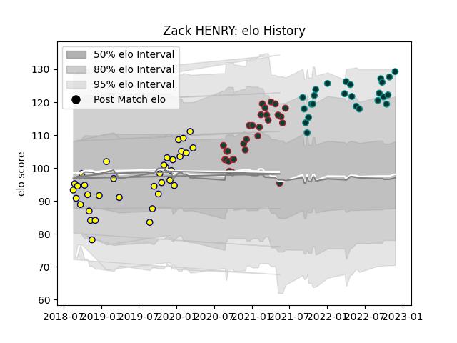

---  
layout: page  
title: Zack HENRY  
date: 2023-02-28 13:57:33.366410  
categories: player  
---
# Zack HENRY

## Positions: FH, FB

## Current elo: 129.0

## Current Percentile: 93.0

# Elo History

# Match History

| Team             |   Appearances |   Win Rate |
|:-----------------|--------------:|-----------:|
| Nevers           |            36 |   0.680556 |
| Leicester Tigers |            29 |   0.448276 |
| Pau              |            25 |   0.48     |

| Opponent             |   Matches |   Win Rate |
|:---------------------|----------:|-----------:|
| Biarritz Olympique   |         5 |   0.8      |
| Provence Rugby       |         4 |   0.5      |
| Vannes               |         4 |   0.5      |
| Brive                |         4 |   0.5      |
| Colomiers            |         4 |   0.5      |
| Perpignan            |         4 |   1        |
| Harlequins           |         3 |   0.333333 |
| Wasps                |         3 |   0.666667 |
| Toulon               |         3 |   0        |
| Stade Francais Paris |         3 |   0.333333 |
| London Irish         |         3 |   0.666667 |
| Sale Sharks          |         3 |   0        |
| Montpellier Herault  |         3 |   0.333333 |
| Exeter Chiefs        |         3 |   0        |
| Gloucester Rugby     |         3 |   0.666667 |
| Aurillac             |         2 |   1        |
| Northampton Saints   |         2 |   0.5      |
| Mont-de-Marsan       |         2 |   1        |
| Soyaux-Angouleme     |         2 |   0.25     |
| Montauban            |         2 |   1        |
| Lyon                 |         2 |   0.5      |
| Massy                |         2 |   1        |
| Clermont Auvergne    |         2 |   0        |
| Beziers              |         2 |   1        |
| Carcassonne          |         2 |   0.5      |
| Bath Rugby           |         2 |   0.5      |
| Castres Olympique    |         2 |   0        |
| Grenoble             |         2 |   0.5      |
| Worcester Warriors   |         2 |   1        |
| Connacht             |         1 |   1        |
| Racing 92            |         1 |   0        |
| Roval Drome XV       |         1 |   1        |
| Oyonnax              |         1 |   1        |
| Bristol Rugby        |         1 |   0        |
| Stade Toulousain     |         1 |   1        |
| Bordeaux Begles      |         1 |   0        |
| US Bressane          |         1 |   1        |
| La Rochelle          |         1 |   1        |
| Bayonne              |         1 |   1        |