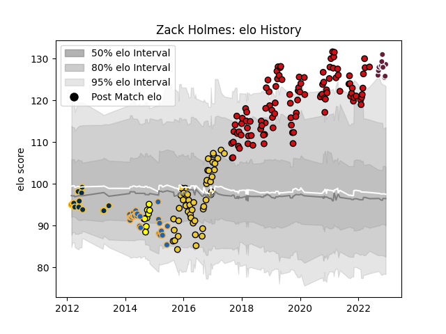

---  
layout: page  
title: Zack Holmes  
date: 2023-02-02 18:49:46.033014  
categories: player  
---
# Zack Holmes

## Positions: FH, C

## Current elo: 115.0

## Current Percentile: 82.0

# Elo History

# Match History

| Team             |   Appearances |   Win Rate |
|:-----------------|--------------:|-----------:|
| Stade Toulousain |           106 |   0.698113 |
| La Rochelle      |            49 |   0.561224 |
| Western Force    |            26 |   0.423077 |
| Bordeaux Begles  |            16 |   0.46875  |
| Brumbies         |            15 |   0.566667 |
| Perth Spirit     |            10 |   0.4      |

| Opponent                 |   Matches |   Win Rate |
|:-------------------------|----------:|-----------:|
| Montpellier Herault      |        15 |   0.666667 |
| Racing 92                |        13 |   0.576923 |
| Castres Olympique        |        13 |   0.5      |
| Pau                      |        12 |   0.666667 |
| Lyon                     |        11 |   0.409091 |
| Toulon                   |        11 |   0.636364 |
| Stade Francais Paris     |         9 |   0.555556 |
| Bordeaux Begles          |         9 |   0.666667 |
| Brive                    |         9 |   0.777778 |
| La Rochelle              |         9 |   0.777778 |
| Clermont Auvergne        |         8 |   0.625    |
| Bayonne                  |         8 |   0.75     |
| Agen                     |         7 |   0.857143 |
| Melbourne Rebels         |         6 |   0.666667 |
| Grenoble                 |         6 |   0.833333 |
| Gloucester Rugby         |         5 |   0.4      |
| Queensland Reds          |         5 |   0.4      |
| Stade Toulousain         |         5 |   0.6      |
| Sharks                   |         4 |   0        |
| Brumbies                 |         4 |   0        |
| Perpignan                |         4 |   0.5      |
| New South Wales Waratahs |         4 |   0.75     |
| Cheetahs                 |         3 |   0.666667 |
| Oyonnax                  |         3 |   0.5      |
| Benetton Treviso         |         2 |   1        |
| Blues                    |         2 |   0        |
| Brisbane City            |         2 |   0        |
| Stormers                 |         2 |   0        |
| Wasps                    |         2 |   1        |
| Melbourne Rising         |         2 |   0.5      |
| Western Force            |         2 |   1        |
| Bath Rugby               |         2 |   1        |
| Leinster                 |         2 |   0.5      |
| Hurricanes               |         2 |   0.5      |
| Highlanders              |         2 |   1        |
| Chiefs                   |         2 |   0.5      |
| Bulls                    |         2 |   0.5      |
| Ulster                   |         1 |   1        |
| Southern Kings           |         1 |   0.5      |
| Sydney Stars             |         1 |   1        |
| Lions                    |         1 |   1        |
| Queensland Country       |         1 |   1        |
| North Harbour Rays       |         1 |   0        |
| NSW Country Eagles       |         1 |   0        |
| Greater Sydney Rams      |         1 |   0        |
| Exeter Chiefs            |         1 |   0        |
| Crusaders                |         1 |   0        |
| Connacht                 |         1 |   1        |
| Canberra Vikings         |         1 |   1        |
| Worcester Warriors       |         1 |   1        |