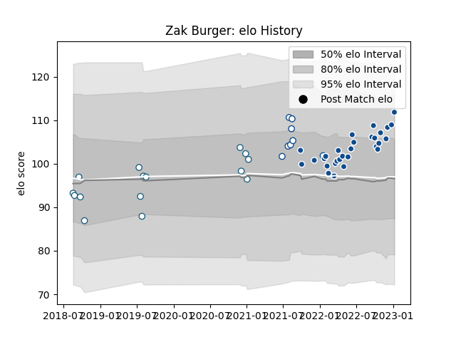

---  
layout: page  
title: Zak Burger  
date: 2022-12-12 15:00:11.033488  
categories: player  
---
# Zak Burger

## Positions: SH

## Current elo: 109.0

## Current Percentile: 85.0

# Elo History

# Match History

| Team       |   Appearances |   Win Rate |
|:-----------|--------------:|-----------:|
| Bulls      |            27 |   0.666667 |
| Griquas    |            12 |   0.333333 |
| Blue Bulls |             6 |   0.833333 |

| Opponent            |   Matches |   Win Rate |
|:--------------------|----------:|-----------:|
| Western Province    |         4 |       0.5  |
| Sharks              |         4 |       0.5  |
| Pumas               |         4 |       0.75 |
| Natal Sharks        |         4 |       0.25 |
| Lions               |         3 |       1    |
| Stormers            |         3 |       0    |
| Ospreys             |         2 |       1    |
| Munster             |         2 |       0.5  |
| Benetton Treviso    |         2 |       1    |
| Golden Lions        |         2 |       0.5  |
| Glasgow Warriors    |         2 |       0.5  |
| Free State Cheetahs |         2 |       0    |
| Connacht            |         2 |       0.5  |
| Leinster            |         2 |       0.5  |
| Griquas             |         1 |       1    |
| Blue Bulls          |         1 |       1    |
| Edinburgh           |         1 |       1    |
| Dragons             |         1 |       1    |
| Scarlets            |         1 |       1    |
| Cardiff Blues       |         1 |       1    |
| Ulster              |         1 |       1    |