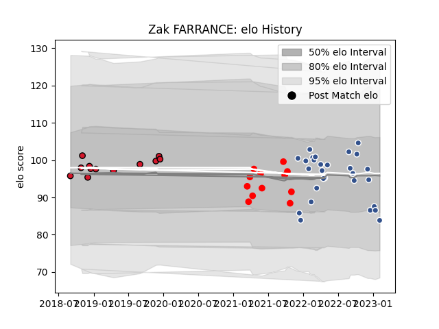

---  
layout: page  
title: Zak FARRANCE  
date: 2023-03-09 10:09:27.546354  
categories: player  
---
# Zak FARRANCE

## Positions: L

## Current elo: 100.0

## Current Percentile: 60.0

# Elo History

# Match History

| Team    |   Appearances |   Win Rate |
|:--------|--------------:|-----------:|
| Agen    |            31 |   0.564516 |
| Jersey  |            12 |   0.541667 |
| Oyonnax |            12 |   0.666667 |

| Opponent            |   Matches |   Win Rate |
|:--------------------|----------:|-----------:|
| Nevers              |         5 |   0.4      |
| Provence Rugby      |         5 |   0.5      |
| Colomiers           |         4 |   0.75     |
| Mont-de-Marsan      |         3 |   0.666667 |
| Aurillac            |         3 |   0.333333 |
| Rouen               |         3 |   1        |
| Grenoble            |         3 |   0.333333 |
| Soyaux-Angouleme    |         3 |   1        |
| Doncaster           |         2 |   0        |
| Carcassonne         |         2 |   1        |
| Biarritz Olympique  |         2 |   0.5      |
| Beziers             |         2 |   0        |
| Bedford             |         2 |   1        |
| Montauban           |         2 |   0.5      |
| Richmond            |         2 |   0.5      |
| Vannes              |         2 |   1        |
| US Bressane         |         1 |   0        |
| Saracens            |         1 |   0        |
| Ampthill            |         1 |   0.5      |
| Oyonnax             |         1 |   0        |
| Narbonne            |         1 |   1        |
| London Scottish     |         1 |   1        |
| Hartpury College    |         1 |   1        |
| Ealing Trailfinders |         1 |   0        |
| Cornish Pirates     |         1 |   1        |
| Massy               |         1 |   1        |