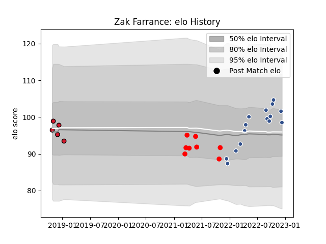

---  
layout: page  
title: Zak Farrance  
date: 2022-12-18 16:13:03.714988  
categories: player  
---
# Zak Farrance

## Positions: L

## Current elo: 93.0

## Current Percentile: 62.0

# Elo History

# Match History

| Team    |   Appearances |   Win Rate |
|:--------|--------------:|-----------:|
| Agen    |            16 |     0.625  |
| Jersey  |             8 |     0.5625 |
| Oyonnax |             5 |     0.6    |

| Opponent           |   Matches |   Win Rate |
|:-------------------|----------:|-----------:|
| Nevers             |         4 |       0.25 |
| Grenoble           |         2 |       0.5  |
| Rouen              |         2 |       1    |
| Biarritz Olympique |         2 |       0.5  |
| Carcassonne        |         2 |       1    |
| Colomiers          |         2 |       0.5  |
| Richmond           |         2 |       0.5  |
| Provence Rugby     |         2 |       1    |
| Massy              |         1 |       1    |
| Saracens           |         1 |       0    |
| Oyonnax            |         1 |       0    |
| Ampthill           |         1 |       0.5  |
| Hartpury College   |         1 |       1    |
| Aurillac           |         1 |       1    |
| Doncaster          |         1 |       0    |
| Cornish Pirates    |         1 |       1    |
| Beziers            |         1 |       0    |
| Bedford            |         1 |       1    |
| Soyaux-Angouleme   |         1 |       1    |