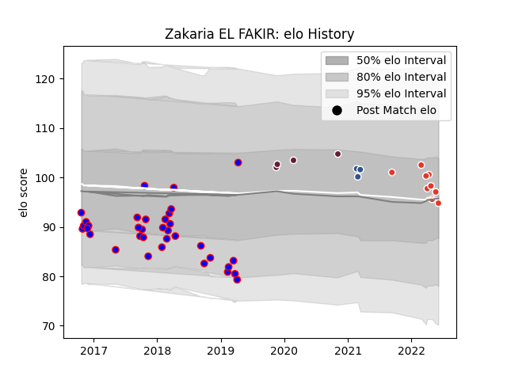

---  
layout: page  
title: Zakaria EL FAKIR  
date: 2023-03-09 10:07:58.161586  
categories: player  
---
# Zakaria EL FAKIR

## Positions: P

## Current elo: 95.0

## Current Percentile: 54.0

# Elo History

# Match History

| Team               |   Appearances |   Win Rate |
|:-------------------|--------------:|-----------:|
| Beziers            |            35 |   0.485714 |
| Biarritz Olympique |             9 |   0.111111 |
| Bordeaux Begles    |             4 |   0.875    |
| Agen               |             3 |   0        |

| Opponent            |   Matches |   Win Rate |
|:--------------------|----------:|-----------:|
| Aurillac            |         4 |   0.25     |
| Nevers              |         3 |   0.833333 |
| Perpignan           |         3 |   0.333333 |
| Montauban           |         3 |   0.166667 |
| Carcassonne         |         3 |   0.666667 |
| Clermont Auvergne   |         3 |   0.333333 |
| Colomiers           |         3 |   0.666667 |
| Narbonne            |         2 |   0.5      |
| Montpellier Herault |         2 |   0        |
| Mont-de-Marsan      |         2 |   0.5      |
| Massy               |         2 |   1        |
| Vannes              |         2 |   0        |
| Biarritz Olympique  |         2 |   0        |
| Bayonne             |         2 |   0.5      |
| Racing 92           |         1 |   0        |
| Provence Rugby      |         1 |   1        |
| Pau                 |         1 |   0        |
| Stade Toulousain    |         1 |   0        |
| Toulon              |         1 |   1        |
| Soyaux-Angouleme    |         1 |   0        |
| Agen                |         1 |   1        |
| Lyon                |         1 |   0        |
| Grenoble            |         1 |   0        |
| Edinburgh           |         1 |   0.5      |
| Dax                 |         1 |   1        |
| Castres Olympique   |         1 |   0        |
| Brive               |         1 |   0        |
| Bourgoin-Jallieu    |         1 |   1        |
| Wasps               |         1 |   1        |