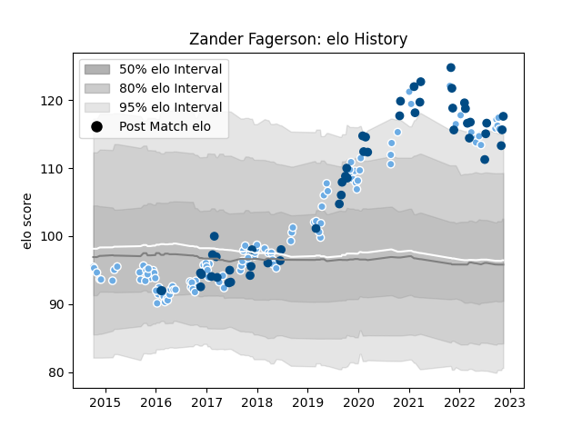

---  
layout: page  
title: Zander Fagerson  
date: 2023-03-21 18:36:41.786729  
categories: player  
---
# Zander Fagerson

Last updated: 2023-03-21
## Positions: P

## Country: Scotland

## Current elo: 109.0

## Current Percentile: 89.0

# Elo History

# Match History

| Team             |   Appearances |   Win Rate |
|:-----------------|--------------:|-----------:|
| Glasgow Warriors |           119 |   0.554622 |
| Scotland         |            56 |   0.571429 |

| Opponent                 |   Matches |   Win Rate |
|:-------------------------|----------:|-----------:|
| Edinburgh                |        17 |   0.411765 |
| Leinster                 |        10 |   0.35     |
| Zebre                    |         8 |   1        |
| Cardiff Blues            |         8 |   0.75     |
| Scarlets                 |         8 |   0.5      |
| France                   |         7 |   0.285714 |
| Connacht                 |         7 |   0.714286 |
| Munster                  |         7 |   0.428571 |
| Italy                    |         7 |   1        |
| Wales                    |         6 |   0.5      |
| Ulster                   |         6 |   0.5      |
| Argentina                |         6 |   0.666667 |
| Exeter Chiefs            |         6 |   0.25     |
| England                  |         5 |   0.4      |
| Australia                |         5 |   0.6      |
| Ospreys                  |         5 |   0.8      |
| Racing 92                |         4 |   0.75     |
| Ireland                  |         4 |   0.25     |
| Benetton Treviso         |         4 |   0.75     |
| La Rochelle              |         4 |   0.25     |
| Dragons                  |         4 |   1        |
| Georgia                  |         4 |   1        |
| Montpellier Herault      |         3 |   0        |
| Cheetahs                 |         3 |   1        |
| Samoa                    |         2 |   1        |
| Bulls                    |         2 |   0.5      |
| Southern Kings           |         2 |   1        |
| Saracens                 |         2 |   0        |
| Fiji                     |         2 |   0.5      |
| Sale Sharks              |         2 |   1        |
| Northampton Saints       |         2 |   0        |
| New Zealand              |         2 |   0        |
| Leicester Tigers         |         2 |   1        |
| Japan                    |         2 |   0.5      |
| Russia                   |         1 |   1        |
| Sharks                   |         1 |   0        |
| South Africa             |         1 |   0        |
| Stormers                 |         1 |   0        |
| Tonga                    |         1 |   1        |
| United States of America |         1 |   0        |
| Lyon                     |         1 |   0        |