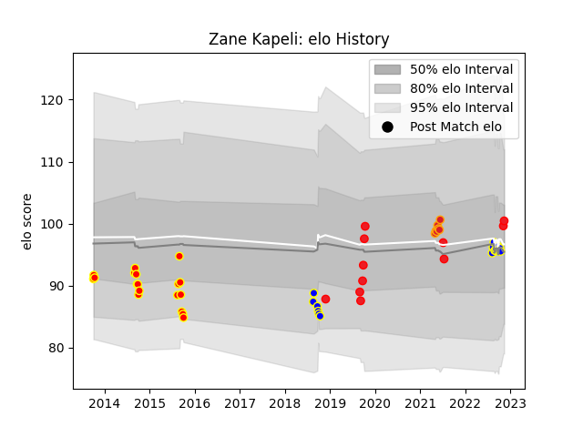

---  
layout: page  
title: Zane Kapeli  
date: 2022-11-22 11:37:50.133160  
categories: player  
---
# Zane Kapeli

## Positions: FL, N8

## Country: Tonga

## Current elo: 103.0

## Current Percentile: 69.0

# Elo History

# Match History

| Team          |   Appearances |   Win Rate |
|:--------------|--------------:|-----------:|
| Bay of Plenty |            18 |   0.555556 |
| Waikato       |            18 |   0.444444 |
| Tonga         |            12 |   0.333333 |
| Chiefs        |             7 |   0.571429 |

| Opponent                 |   Matches |   Win Rate |
|:-------------------------|----------:|-----------:|
| Taranaki                 |         4 |   0.75     |
| Counties Manukau         |         4 |   0.5      |
| Bay of Plenty            |         3 |   1        |
| Waikato                  |         3 |   0.333333 |
| Auckland                 |         3 |   0.333333 |
| Otago                    |         3 |   0.333333 |
| Tasman                   |         3 |   0        |
| Manawatu                 |         3 |   0.333333 |
| Southland                |         2 |   1        |
| New Zealand              |         2 |   0        |
| North Harbour            |         2 |   1        |
| Northland                |         2 |   0.5      |
| Wellington               |         2 |   0        |
| Spain                    |         1 |   1        |
| Samoa                    |         1 |   0        |
| Queensland Reds          |         1 |   0        |
| United States of America |         1 |   1        |
| Uruguay                  |         1 |   1        |
| Argentina                |         1 |   0        |
| New South Wales Waratahs |         1 |   1        |
| Melbourne Rebels         |         1 |   1        |
| Hawke's Bay              |         1 |   1        |
| Georgia                  |         1 |   0        |
| France                   |         1 |   0        |
| Fiji                     |         1 |   0        |
| England                  |         1 |   0        |
| Crusaders                |         1 |   0        |
| Chile                    |         1 |   1        |
| Canterbury               |         1 |   0        |
| Brumbies                 |         1 |   1        |
| Blues                    |         1 |   0        |
| Western Force            |         1 |   1        |