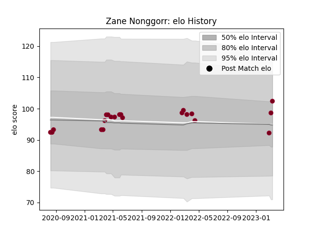

---  
layout: page  
title: Zane Nonggorr  
date: 2023-03-21 18:07:28.823527  
categories: player  
---
# Zane Nonggorr

Last updated: 2023-03-21
## Positions: P

## Current elo: 98.0

## Current Percentile: 73.0

# Elo History

# Match History

| Team            |   Appearances |   Win Rate |
|:----------------|--------------:|-----------:|
| Queensland Reds |            22 |   0.727273 |

| Opponent                 |   Matches |   Win Rate |
|:-------------------------|----------:|-----------:|
| Brumbies                 |         5 |   0.8      |
| Melbourne Rebels         |         4 |   1        |
| Western Force            |         4 |   0.75     |
| New South Wales Waratahs |         3 |   0.666667 |
| Fijian Drua              |         2 |   1        |
| Hurricanes               |         2 |   0        |
| Blues                    |         1 |   0        |
| Chiefs                   |         1 |   1        |