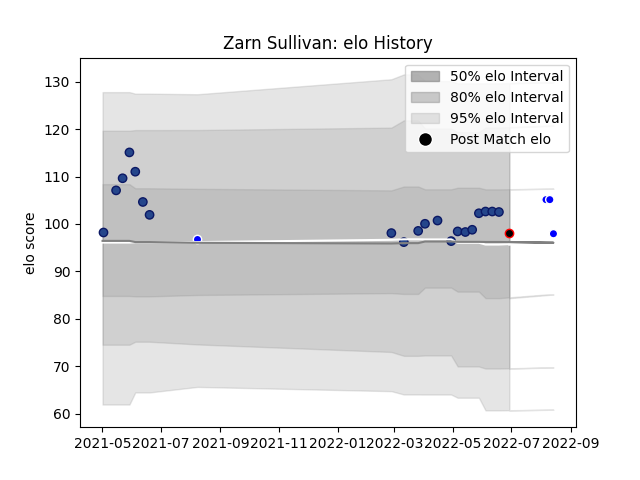

---  
layout: page  
title: Zarn Sullivan  
date: 2023-03-21 18:09:19.946228  
categories: player  
---
# Zarn Sullivan

Last updated: 2023-03-21
## Positions: FB

## Country: New Zealand Maori

## Current elo: 98.0

## Current Percentile: 64.0

# Elo History

# Match History

| Team              |   Appearances |   Win Rate |
|:------------------|--------------:|-----------:|
| Blues             |            20 |        0.9 |
| Auckland          |             4 |        1   |
| New Zealand Maori |             1 |        1   |

| Opponent                 |   Matches |   Win Rate |
|:-------------------------|----------:|-----------:|
| Highlanders              |         4 |        1   |
| Brumbies                 |         3 |        1   |
| Crusaders                |         2 |        0.5 |
| Melbourne Rebels         |         2 |        1   |
| New South Wales Waratahs |         2 |        1   |
| Queensland Reds          |         2 |        1   |
| Western Force            |         2 |        1   |
| Canterbury               |         1 |        1   |
| Chiefs                   |         1 |        1   |
| Hurricanes               |         1 |        0   |
| Ireland                  |         1 |        1   |
| Manawatu                 |         1 |        1   |
| Moana Pasifika           |         1 |        1   |
| North Harbour            |         1 |        1   |
| Southland                |         1 |        1   |