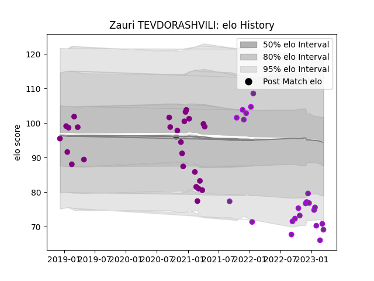

---  
layout: page  
title: Zauri TEVDORASHVILI  
date: 2023-02-24 14:47:06.373202  
categories: player  
---
# Zauri TEVDORASHVILI

## Positions: P

## Current elo: 62.0

## Current Percentile: 2.0

# Elo History

# Match History

| Team             |   Appearances |   Win Rate |
|:-----------------|--------------:|-----------:|
| Soyaux-Angouleme |            27 |   0.296296 |
| US Bressane      |            21 |   0.428571 |

| Opponent                   |   Matches |   Win Rate |
|:---------------------------|----------:|-----------:|
| Provence Rugby             |         4 |   0.625    |
| Montauban                  |         4 |   0.125    |
| Vannes                     |         3 |   0        |
| Beziers                    |         3 |   1        |
| Mont-de-Marsan             |         3 |   0.333333 |
| Colomiers                  |         2 |   0        |
| Nevers                     |         2 |   0        |
| Aurillac                   |         2 |   0.5      |
| Dax                        |         2 |   0        |
| Rouen                      |         2 |   0.5      |
| Perpignan                  |         2 |   0        |
| Chambery                   |         2 |   0.5      |
| Carqueiranne-Hyères        |         2 |   0.5      |
| Valence Romans Drome Rugby |         2 |   1        |
| Blagnac                    |         2 |   0.5      |
| Biarritz Olympique         |         2 |   0        |
| Oyonnax                    |         2 |   0        |
| Tarbes                     |         1 |   1        |
| Albi                       |         1 |   0        |
| Narbonne                   |         1 |   0        |
| Cognac Saint Jean d'Angély |         1 |   1        |
| Carcassonne                |         1 |   0        |
| Brive                      |         1 |   0        |
| Grenoble                   |         1 |   1        |