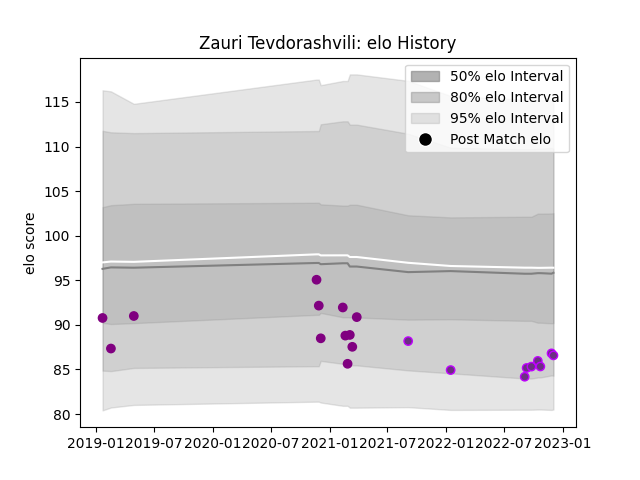

---  
layout: page  
title: Zauri Tevdorashvili  
date: 2022-12-14 11:11:47.691072  
categories: player  
---
# Zauri Tevdorashvili

## Positions: P

## Current elo: 87.0

## Current Percentile: 14.0

# Elo History

# Match History

| Team             |   Appearances |   Win Rate |
|:-----------------|--------------:|-----------:|
| Soyaux-Angouleme |            12 |       0.25 |
| US Bressane      |            10 |       0.55 |

| Opponent                   |   Matches |   Win Rate |
|:---------------------------|----------:|-----------:|
| Biarritz Olympique         |         2 |       0    |
| Valence Romans Drome Rugby |         2 |       1    |
| Provence Rugby             |         2 |       0.75 |
| Perpignan                  |         2 |       0    |
| Albi                       |         1 |       0    |
| Narbonne                   |         1 |       0    |
| Tarbes                     |         1 |       1    |
| Rouen                      |         1 |       0    |
| Oyonnax                    |         1 |       0    |
| Mont-de-Marsan             |         1 |       0    |
| Beziers                    |         1 |       1    |
| Dax                        |         1 |       0    |
| Colomiers                  |         1 |       0    |
| Chambery                   |         1 |       1    |
| Carqueiranne-Hyères        |         1 |       1    |
| Brive                      |         1 |       0    |
| Blagnac                    |         1 |       1    |
| Vannes                     |         1 |       0    |