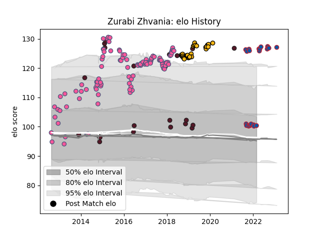

---  
layout: page  
title: Zurabi Zhvania  
date: 2023-02-04 18:26:29.952628  
categories: player  
---
# Zurabi Zhvania

## Positions: P

## Country: Georgia

## Current elo: 100.0

## Current Percentile: 96.0

# Elo History

# Match History

| Team                 |   Appearances |   Win Rate |
|:---------------------|--------------:|-----------:|
| Stade Francais Paris |           107 |   0.5      |
| Wasps                |            31 |   0.370968 |
| Georgia              |            23 |   0.76087  |
| Grenoble             |            22 |   0.545455 |

| Opponent                 |   Matches |   Win Rate |
|:-------------------------|----------:|-----------:|
| Stade Toulousain         |         9 |   0        |
| Agen                     |         7 |   0.714286 |
| Brive                    |         7 |   0.571429 |
| Bath Rugby               |         6 |   0.583333 |
| Grenoble                 |         6 |   0.5      |
| Racing 92                |         6 |   0.5      |
| Montpellier Herault      |         5 |   0.4      |
| Castres Olympique        |         5 |   0.6      |
| Harlequins               |         5 |   0.4      |
| Bordeaux Begles          |         5 |   0.4      |
| Edinburgh                |         5 |   0.4      |
| Oyonnax                  |         5 |   0.4      |
| Toulon                   |         5 |   0.6      |
| London Irish             |         4 |   0.25     |
| La Rochelle              |         4 |   0.625    |
| Pau                      |         4 |   0.25     |
| Gloucester Rugby         |         4 |   0.25     |
| Leicester Tigers         |         4 |   0.25     |
| Clermont Auvergne        |         4 |   0.5      |
| Exeter Chiefs            |         3 |   0.333333 |
| Beziers                  |         3 |   0.333333 |
| Germany                  |         3 |   1        |
| Cavalieri Prato          |         3 |   1        |
| Tonga                    |         3 |   0.666667 |
| Newcastle Falcons        |         3 |   0.666667 |
| Spain                    |         3 |   1        |
| Dragons                  |         2 |   0        |
| Samoa                    |         2 |   0.75     |
| Benetton Treviso         |         2 |   1        |
| Russia                   |         2 |   1        |
| Sale Sharks              |         2 |   0.5      |
| Timisoara Saracens       |         2 |   1        |
| Saracens                 |         2 |   0        |
| Belgium                  |         2 |   1        |
| Bayonne                  |         2 |   0.5      |
| Vannes                   |         2 |   0.5      |
| Northampton Saints       |         2 |   0.5      |
| Narbonne                 |         2 |   0.75     |
| Worcester Warriors       |         2 |   1        |
| London Welsh             |         2 |   1        |
| Aurillac                 |         2 |   0.5      |
| Leinster                 |         2 |   0        |
| Bucarest Wolves          |         2 |   1        |
| Japan                    |         2 |   0.5      |
| Italy                    |         2 |   0        |
| Bucuresti                |         2 |   1        |
| Carcassonne              |         2 |   0.5      |
| Lusitanos XV             |         2 |   1        |
| Lyon                     |         2 |   0        |
| Krasny Yar Krasnoyarsk   |         1 |   0        |
| US Bressane              |         1 |   1        |
| Krasny Yar               |         1 |   0        |
| United States of America |         1 |   1        |
| Fiji                     |         1 |   1        |
| Ireland                  |         1 |   0        |
| Montauban                |         1 |   1        |
| Bristol Rugby            |         1 |   1        |
| Provence Rugby           |         1 |   0        |
| Portugal                 |         1 |   1        |
| Biarritz Olympique       |         1 |   0        |
| Ospreys                  |         1 |   1        |
| Nevers                   |         1 |   0.5      |
| Colomiers                |         1 |   0        |
| Munster                  |         1 |   0        |
| Rouen                    |         1 |   1        |