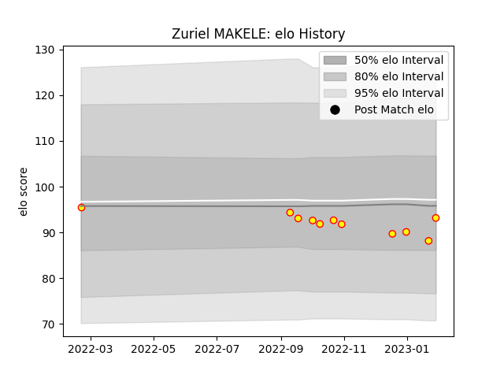

---  
layout: page  
title: Zuriel MAKELE  
date: 2023-02-02 18:49:12.047347  
categories: player  
---
# Zuriel MAKELE

## Positions: C

## Current elo: 94.0

## Current Percentile: None

# Elo History

# Match History

| Team     |   Appearances |   Win Rate |
|:---------|--------------:|-----------:|
| Richmond |            11 |   0.272727 |

| Opponent            |   Matches |   Win Rate |
|:--------------------|----------:|-----------:|
| Hartpury College    |         2 |        0.5 |
| Ampthill            |         1 |        0   |
| Bedford             |         1 |        1   |
| Caldy               |         1 |        0   |
| Cornish Pirates     |         1 |        0   |
| Coventry            |         1 |        0   |
| Doncaster           |         1 |        0   |
| Ealing Trailfinders |         1 |        0   |
| London Scottish     |         1 |        1   |
| Nottingham          |         1 |        0   |