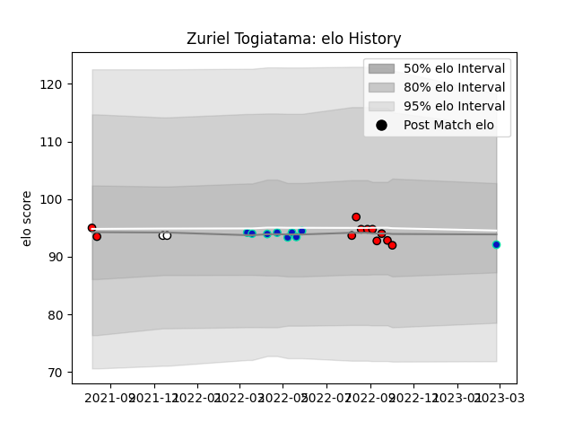

---  
layout: page  
title: Zuriel Togiatama  
date: 2023-03-02 11:20:17.191540  
categories: player  
---
# Zuriel Togiatama

## Positions: H

## Country: Fiji

## Current elo: 92.0

## Current Percentile: 41.0

# Elo History

# Match History

| Team             |   Appearances |   Win Rate |
|:-----------------|--------------:|-----------:|
| Counties Manukau |            11 |   0.272727 |
| Fijian Drua      |             9 |   0.222222 |
| Fiji             |             2 |   0.25     |

| Opponent        |   Matches |   Win Rate |
|:----------------|----------:|-----------:|
| Manawatu        |         2 |        0.5 |
| Moana Pasifika  |         2 |        1   |
| North Harbour   |         2 |        0   |
| Wellington      |         1 |        0   |
| Wales           |         1 |        0   |
| Waikato         |         1 |        0   |
| Southland       |         1 |        0   |
| Queensland Reds |         1 |        0   |
| Otago           |         1 |        1   |
| Bay of Plenty   |         1 |        1   |
| Blues           |         1 |        0   |
| Hurricanes      |         1 |        0   |
| Hawke's Bay     |         1 |        0   |
| Georgia         |         1 |        0.5 |
| Crusaders       |         1 |        0   |
| Chiefs          |         1 |        0   |
| Canterbury      |         1 |        0   |
| Brumbies        |         1 |        0   |
| Western Force   |         1 |        0   |