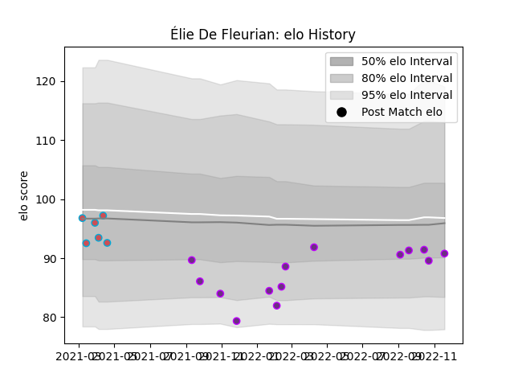

---  
layout: page  
title: Élie De Fleurian  
date: 2022-12-09 13:10:16.940550  
categories: player  
---
# Élie De Fleurian

## Positions: W

## Current elo: 90.0

## Current Percentile: 34.0

# Elo History

# Match History

| Team             |   Appearances |   Win Rate |
|:-----------------|--------------:|-----------:|
| US Bressane      |            16 |   0.4375   |
| Bourgoin-Jallieu |             6 |   0.166667 |

| Opponent                   |   Matches |   Win Rate |
|:---------------------------|----------:|-----------:|
| Carcassonne                |         2 |        0   |
| Cognac Saint Jean d'Angély |         2 |        0.5 |
| Dax                        |         2 |        0   |
| Agen                       |         1 |        1   |
| Narbonne                   |         1 |        0   |
| Valence Romans Drome Rugby |         1 |        1   |
| US Bressane                |         1 |        0   |
| Suresnes                   |         1 |        1   |
| Rouen                      |         1 |        0.5 |
| Nice                       |         1 |        0   |
| Nevers                     |         1 |        0   |
| Massy                      |         1 |        1   |
| Montauban                  |         1 |        0.5 |
| Albi                       |         1 |        0   |
| Carqueiranne-Hyères        |         1 |        1   |
| Bayonne                    |         1 |        0   |
| Aurillac                   |         1 |        1   |
| Aubenas                    |         1 |        0   |
| Vannes                     |         1 |        0   |