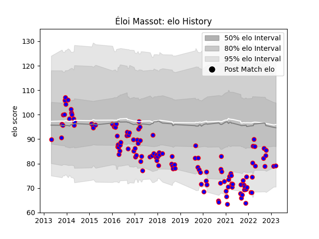

---  
layout: page  
title: Éloi Massot  
date: 2023-02-15 22:15:07.858047  
categories: player  
---
# Éloi Massot

## Positions: FL

## Current elo: 74.0

## Current Percentile: 13.0

# Elo History

# Match History

| Team    |   Appearances |   Win Rate |
|:--------|--------------:|-----------:|
| Beziers |           126 |   0.428571 |

| Opponent                   |   Matches |   Win Rate |
|:---------------------------|----------:|-----------:|
| Mont-de-Marsan             |        13 |   0.346154 |
| Colomiers                  |        12 |   0.333333 |
| Aurillac                   |         9 |   0.555556 |
| Oyonnax                    |         8 |   0.25     |
| Biarritz Olympique         |         7 |   0.142857 |
| Narbonne                   |         7 |   0.571429 |
| Montauban                  |         7 |   0.714286 |
| Soyaux-Angouleme           |         6 |   0.333333 |
| Albi                       |         4 |   0.75     |
| Perpignan                  |         4 |   0.25     |
| Nevers                     |         4 |   0.5      |
| Agen                       |         4 |   0.75     |
| Bourgoin-Jallieu           |         4 |   0.5      |
| Carcassonne                |         4 |   0        |
| Dax                        |         4 |   0.5      |
| US Bressane                |         3 |   0.333333 |
| Rouen                      |         3 |   0.666667 |
| Vannes                     |         3 |   0.333333 |
| Grenoble                   |         3 |   0.666667 |
| Massy                      |         2 |   1        |
| Provence Rugby             |         2 |   0        |
| Roval Drome XV             |         2 |   1        |
| Bayonne                    |         2 |   0.5      |
| La Rochelle                |         2 |   0        |
| Valence Romans Drome Rugby |         2 |   0.75     |
| Lyon                       |         2 |   0        |
| Brive                      |         1 |   0        |
| Pau                        |         1 |   0        |
| Tarbes                     |         1 |   1        |