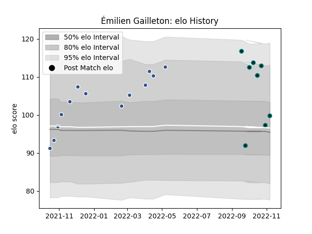

---  
layout: page  
title: Émilien Gailleton  
date: 2022-12-09 13:17:48.136317  
categories: player  
---
# Émilien Gailleton

## Positions: C

## Current elo: 116.0

## Current Percentile: 92.0

# Elo History

# Match History

| Team   |   Appearances |   Win Rate |
|:-------|--------------:|-----------:|
| Agen   |            13 |   0.461538 |
| Pau    |            10 |   0.4      |

| Opponent             |   Matches |   Win Rate |
|:---------------------|----------:|-----------:|
| Aurillac             |         2 |        0.5 |
| Rouen                |         2 |        0.5 |
| Montauban            |         2 |        0.5 |
| Oyonnax              |         1 |        0   |
| US Bressane          |         1 |        0   |
| Toulon               |         1 |        0   |
| Stade Toulousain     |         1 |        1   |
| Stade Francais Paris |         1 |        0   |
| Racing 92            |         1 |        0   |
| Provence Rugby       |         1 |        1   |
| Nevers               |         1 |        1   |
| Bordeaux Begles      |         1 |        1   |
| Montpellier Herault  |         1 |        0   |
| Lyon                 |         1 |        0   |
| La Rochelle          |         1 |        1   |
| Colomiers            |         1 |        1   |
| Castres Olympique    |         1 |        0   |
| Carcassonne          |         1 |        0   |
| Brive                |         1 |        1   |
| Vannes               |         1 |        0   |