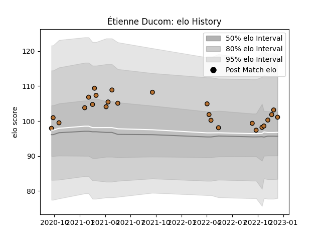

---  
layout: page  
title: Étienne Ducom  
date: 2022-12-18 16:38:56.560850  
categories: player  
---
# Étienne Ducom

## Positions: W

## Current elo: 101.0

## Current Percentile: 76.0

# Elo History

# Match History

| Team     |   Appearances |   Win Rate |
|:---------|--------------:|-----------:|
| Narbonne |            25 |       0.56 |

| Opponent                   |   Matches |   Win Rate |
|:---------------------------|----------:|-----------:|
| Blagnac                    |         3 |   0.833333 |
| Dax                        |         3 |   0.333333 |
| Tarbes                     |         2 |   0.5      |
| Suresnes                   |         2 |   0.5      |
| Cognac Saint Jean d'Angély |         2 |   1        |
| Albi                       |         1 |   0        |
| Nice                       |         1 |   1        |
| US Bressane                |         1 |   1        |
| Rennes                     |         1 |   1        |
| Provence Rugby             |         1 |   1        |
| Grenoble                   |         1 |   0.5      |
| Massy                      |         1 |   1        |
| Aubenas                    |         1 |   1        |
| Colomiers                  |         1 |   0        |
| Chambery                   |         1 |   0        |
| Bourgoin-Jallieu           |         1 |   0        |
| Beziers                    |         1 |   0        |
| Vannes                     |         1 |   0        |