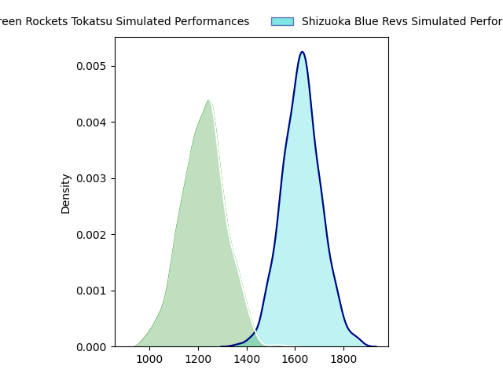
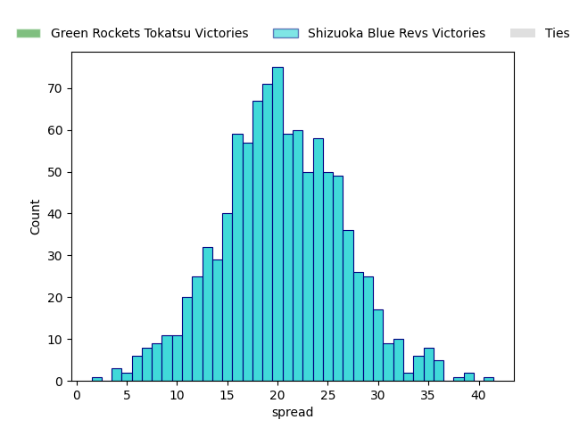

---  
layout: page  
title: Green Rockets Tokatsu at Shizuoka Blue Revs  
date: 2023-01-29 00:00:00 18:00:00 -0500  
categories: match prediction imputed  
---
# Green Rockets Tokatsu at Shizuoka Blue Revs

# Club Level Predictions

The first set of predictions treats a club as the smallest object, as the club develops its members, organizes a gameplan, and deploys its players as needed for each match. This club model has a prediction of 0.904, which translates to predicting Shizuoka Blue Revs to win by 20.4.

Each club has a rating and a rating deviation (simiar to a Glicko system), and expected performances can be generated. This allows for simulated matches and spreads like the ones below.
## Projected Performances

## Projected Spreads

# Player Level Predictions

Treating teams instead as an entity made up of the currently active players, I have ratings for each player in an altogether different system. These can be combined to form team ratings once teamsheets are announced, weighting starters a bit higher than the reserves. Before teamsheets are announced (and added here), team ratings are calculated as an average of recent team ratings.
## Predictions without Teamsheets

### Green Rockets Tokatsu (~1433.61) at Shizuoka Blue Revs (~1500.33)

#### Prediction: Shizuoka Blue Revs by 10.7

Shizuoka Blue Revs by 6.7 on a neutral pitch

