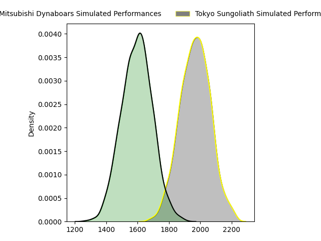

---  
layout: page  
title: Mitsubishi Dynaboars at Tokyo Sungoliath  
date: 2023-01-29 00:00:00 18:00:00 -0500  
categories: match prediction imputed  
---
# Mitsubishi Dynaboars at Tokyo Sungoliath

# Club Level Predictions

The first set of predictions treats a club as the smallest object, as the club develops its members, organizes a gameplan, and deploys its players as needed for each match. This club model has a prediction of 0.887, which translates to predicting Tokyo Sungoliath to win by 18.6.

Each club has a rating and a rating deviation (simiar to a Glicko system), and expected performances can be generated. This allows for simulated matches and spreads like the ones below.
## Projected Performances

## Projected Spreads

# Player Level Predictions

Treating teams instead as an entity made up of the currently active players, I have ratings for each player in an altogether different system. These can be combined to form team ratings once teamsheets are announced, weighting starters a bit higher than the reserves. Before teamsheets are announced (and added here), team ratings are calculated as an average of recent team ratings.
## Predictions without Teamsheets

### Mitsubishi Dynaboars (~1474.9) at Tokyo Sungoliath (~1722.28)

#### Prediction: Tokyo Sungoliath by 28.7

Tokyo Sungoliath by 24.7 on a neutral pitch

