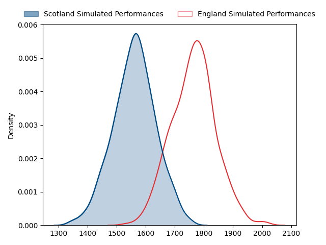
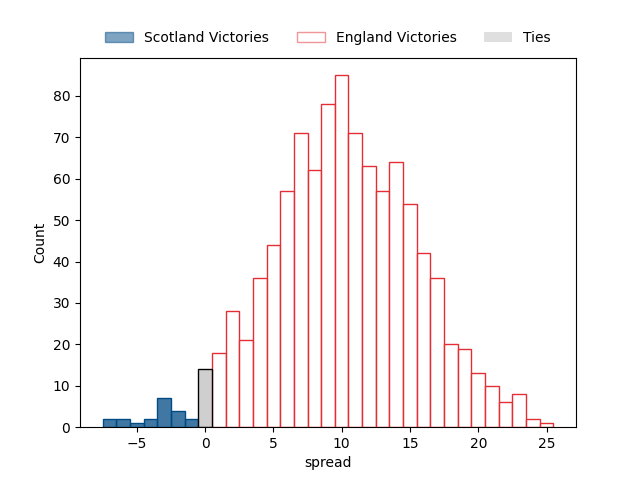
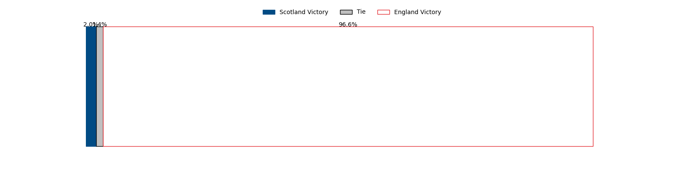

---  
layout: page  
title: Scotland at England  
date: 2023-02-04 11:45:00 18:00:00 -0500  
categories: match projection  
---
# Scotland at England

# Club Level Predictions

The first set of predictions treats a club as the smallest object, as the club develops its members, organizes a gameplan, and deploys its players as needed for each match. This club model has a prediction of 0.761, which translates to predicting England to win by 10.2.

Each club has a rating and a rating deviation (simiar to a Glicko system), and expected performances can be generated. This allows for simulated matches and spreads like the ones below.
## Projected Performances

## Projected Spreads

## Projected Results

# Player Level Predictions

Treating teams instead as an entity made up of the currently active players, I have ratings for each player in an altogether different system. These can be combined to form team ratings once teamsheets are announced, weighting starters a bit higher than the reserves. After the match is played, players can be weighted by their minutes on the field, allowing for an accurate measure of the team's composition. With these compiled team ratings, we can make predictions, measure inaccuracy, and update the individual player ratings.
## Prediction without Player Minutes: Scotland by 5.6

Scotland by 9.6 on a neutral field

| Away Player                                                         |   Away elo |   Away Percentile |   Number |   Home Percentile |   Home elo | Home Player                                                               |
|:--------------------------------------------------------------------|-----------:|------------------:|---------:|------------------:|-----------:|:--------------------------------------------------------------------------|
| [Pierre Schoeman](..//playerfiles//PierreSchoeman_cleaned.md)       |      88.05 |                24 |        1 |                33 |      90.72 | [Ellis Genge](..//playerfiles//EllisGenge_cleaned.md)                     |
| [George Turner](..//playerfiles//GeorgeTurner_cleaned.md)           |     131.29 |                98 |        2 |               100 |     155.34 | [Jamie George](..//playerfiles//JamieGeorge_cleaned.md)                   |
| [WP Nel](..//playerfiles//WPNel_cleaned.md)                         |     134.95 |                98 |        3 |                84 |     109.31 | [Kyle Sinckler](..//playerfiles//KyleSinckler_cleaned.md)                 |
| [Richie Gray](..//playerfiles//RichieGray_cleaned.md)               |     116.43 |                88 |        4 |                74 |     105.7  | [Maro Itoje](..//playerfiles//MaroItoje_cleaned.md)                       |
| [Grant Gilchrist](..//playerfiles//GrantGilchrist_cleaned.md)       |     130.2  |                97 |        5 |                93 |     122.73 | [Ollie Chessum](..//playerfiles//OllieChessum_cleaned.md)                 |
| [Jamie Ritchie](..//playerfiles//JamieRitchie_cleaned.md)           |     150.57 |                99 |        6 |                35 |      91.27 | [Lewis Ludlam](..//playerfiles//LewisLudlam_cleaned.md)                   |
| [Luke Crosbie](..//playerfiles//LukeCrosbie_cleaned.md)             |     129.94 |                96 |        7 |                39 |      91.82 | [Ben Curry](..//playerfiles//BenCurry_cleaned.md)                         |
| [Matt Fagerson](..//playerfiles//MattFagerson_cleaned.md)           |     114.53 |                84 |        8 |                99 |     143.36 | [Alex Dombrandt](..//playerfiles//AlexDombrandt_cleaned.md)               |
| [Ben White](..//playerfiles//BenWhite_cleaned.md)                   |     113.36 |                88 |        9 |                58 |      99.3  | [Jack van Poortvliet](..//playerfiles//JackvanPoortvliet_cleaned.md)      |
| [Finn Russell](..//playerfiles//FinnRussell_cleaned.md)             |     139.32 |                97 |       10 |                90 |     122.85 | [Marcus Smith](..//playerfiles//MarcusSmith_cleaned.md)                   |
| [Duhan van der Merwe](..//playerfiles//DuhanvanderMerwe_cleaned.md) |      99.26 |                60 |       11 |                51 |      96.64 | [Ollie Hassell-Collins](..//playerfiles//OllieHassell-Collins_cleaned.md) |
| [Sione Tuipulotu](..//playerfiles//SioneTuipulotu_cleaned.md)       |      88.72 |                31 |       12 |                96 |     137.35 | [Owen Farrell](..//playerfiles//OwenFarrell_cleaned.md)                   |
| [Huw Jones](..//playerfiles//HuwJones_cleaned.md)                   |      82.29 |                17 |       13 |                46 |      94.44 | [Joe Marchant](..//playerfiles//JoeMarchant_cleaned.md)                   |
| [Kyle Steyn](..//playerfiles//KyleSteyn_cleaned.md)                 |     109.11 |                80 |       14 |                44 |      94.26 | [Max Malins](..//playerfiles//MaxMalins_cleaned.md)                       |
| [Stuart Hogg](..//playerfiles//StuartHogg_cleaned.md)               |     108.77 |                75 |       15 |                69 |     105.99 | [Freddie Steward](..//playerfiles//FreddieSteward_cleaned.md)             |
| [Fraser Brown](..//playerfiles//FraserBrown_cleaned.md)             |     127.36 |                97 |       16 |                23 |      86.79 | [Jack Walker](..//playerfiles//JackWalker_cleaned.md)                     |
| [Jamie Bhatti](..//playerfiles//JamieBhatti_cleaned.md)             |     118.6  |                94 |       17 |                99 |     138.75 | [Mako Vunipola](..//playerfiles//MakoVunipola_cleaned.md)                 |
| [Simon Berghan](..//playerfiles//SimonBerghan_cleaned.md)           |      92.22 |                39 |       18 |                30 |      89.76 | [Dan Cole](..//playerfiles//DanCole_cleaned.md)                           |
| [Jonny Gray](..//playerfiles//JonnyGray_cleaned.md)                 |      94.36 |                46 |       19 |                26 |      87.73 | [Nick Isiekwe](..//playerfiles//NickIsiekwe_cleaned.md)                   |
| [Jack Dempsey](..//playerfiles//JackDempsey_cleaned.md)             |      87.77 |                28 |       20 |                82 |     111.47 | [Ben Earl](..//playerfiles//BenEarl_cleaned.md)                           |
| [George Horne](..//playerfiles//GeorgeHorne_cleaned.md)             |     129.83 |                97 |       21 |                45 |      94.59 | [Ben Youngs](..//playerfiles//BenYoungs_cleaned.md)                       |
| [Blair Kinghorn](..//playerfiles//BlairKinghorn_cleaned.md)         |     148.3  |                99 |       22 |                32 |      89.12 | [Ollie Lawrence](..//playerfiles//OllieLawrence_cleaned.md)               |
| [Chris Harris](..//playerfiles//ChrisHarris_cleaned.md)             |     110.76 |                80 |       23 |                18 |      84.08 | [Anthony Watson](..//playerfiles//AnthonyWatson_cleaned.md)               |

