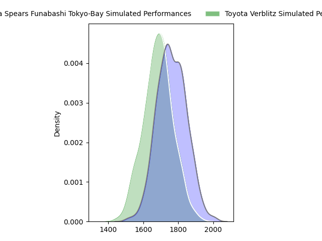
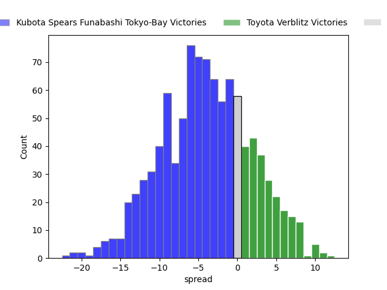

---  
layout: page  
title: Kubota Spears Funabashi Tokyo-Bay at Toyota Verblitz  
date: 2023-02-04 00:00:00 18:00:00 -0500  
categories: match prediction imputed  
---
# Kubota Spears Funabashi Tokyo-Bay at Toyota Verblitz

# Club Level Predictions

The first set of predictions treats a club as the smallest object, as the club develops its members, organizes a gameplan, and deploys its players as needed for each match. This club model has a prediction of 0.387, which translates to predicting Kubota Spears Funabashi Tokyo-Bay to win by 3.9.

Each club has a rating and a rating deviation (simiar to a Glicko system), and expected performances can be generated. This allows for simulated matches and spreads like the ones below.
## Projected Performances

## Projected Spreads

# Player Level Predictions

Treating teams instead as an entity made up of the currently active players, I have ratings for each player in an altogether different system. These can be combined to form team ratings once teamsheets are announced, weighting starters a bit higher than the reserves. Before teamsheets are announced (and added here), team ratings are calculated as an average of recent team ratings.
## Predictions without Teamsheets

### Kubota Spears Funabashi Tokyo-Bay (~1663.01) at Toyota Verblitz (~1474.78)

#### Prediction: Kubota Spears Funabashi Tokyo-Bay by 14.8

Kubota Spears Funabashi Tokyo-Bay by 18.8 on a neutral pitch

