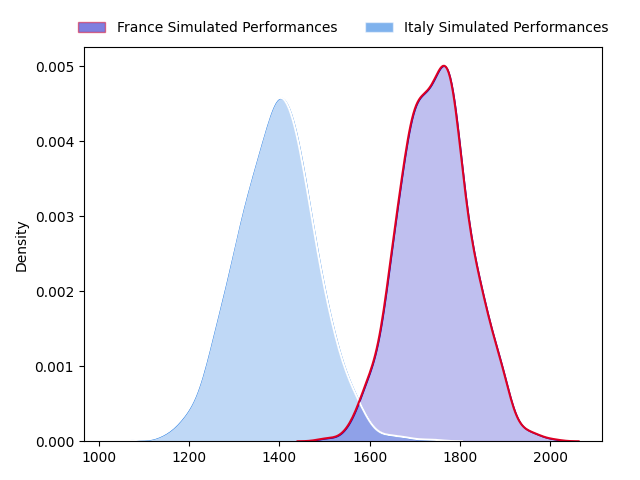
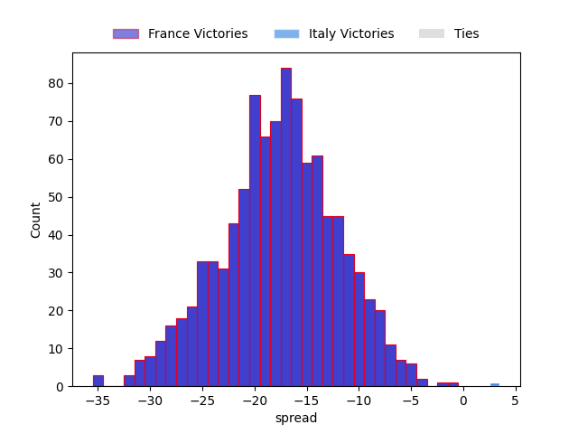
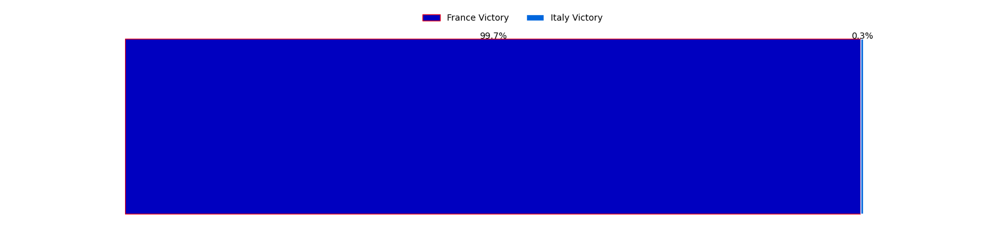

---  
layout: page  
title: France at Italy  
date: 2023-02-05 10:00:00 18:00:00 -0500  
categories: match projection  
---
# France at Italy

# Club Level Predictions

The first set of predictions treats a club as the smallest object, as the club develops its members, organizes a gameplan, and deploys its players as needed for each match. This club model has a prediction of 0.12, which translates to predicting France to win by 17.9.

Each club has a rating and a rating deviation (simiar to a Glicko system), and expected performances can be generated. This allows for simulated matches and spreads like the ones below.
## Projected Performances

## Projected Spreads

## Projected Results

# Player Level Predictions

Treating teams instead as an entity made up of the currently active players, I have ratings for each player in an altogether different system. These can be combined to form team ratings once teamsheets are announced, weighting starters a bit higher than the reserves. After the match is played, players can be weighted by their minutes on the field, allowing for an accurate measure of the team's composition. With these compiled team ratings, we can make predictions, measure inaccuracy, and update the individual player ratings.
## Prediction without Player Minutes: France by 12.7

France by 16.7 on a neutral field

| Away Player                                                       |   Away elo |   Away Percentile |   Number |   Home Percentile |   Home elo | Home Player                                                           |
|:------------------------------------------------------------------|-----------:|------------------:|---------:|------------------:|-----------:|:----------------------------------------------------------------------|
| [Cyril Baille](..//playerfiles//CyrilBaille_cleaned.md)           |      93.9  |                43 |        1 |                37 |      92.59 | [Danilo Fischetti](..//playerfiles//DaniloFischetti_cleaned.md)       |
| [Julien Marchand](..//playerfiles//JulienMarchand_cleaned.md)     |      99.26 |                62 |        2 |                96 |     126.72 | [Giacomo Nicotera](..//playerfiles//GiacomoNicotera_cleaned.md)       |
| [Uini Atonio](..//playerfiles//UiniAtonio_cleaned.md)             |     126.22 |                97 |        3 |                54 |      97.08 | [Simone Ferrari](..//playerfiles//SimoneFerrari_cleaned.md)           |
| [Thibaud Flament](..//playerfiles//ThibaudFlament_cleaned.md)     |     107.37 |                76 |        4 |                 1 |      55.89 | [Niccolo Cannone](..//playerfiles//NiccoloCannone_cleaned.md)         |
| [Paul Willemse](..//playerfiles//PaulWillemse_cleaned.md)         |     135.8  |                97 |        5 |                75 |     106.6  | [Federico Ruzza](..//playerfiles//FedericoRuzza_cleaned.md)           |
| [Anthony Jelonch](..//playerfiles//AnthonyJelonch_cleaned.md)     |      85.93 |                21 |        6 |                36 |      90.86 | [Sebastian Negri](..//playerfiles//SebastianNegri_cleaned.md)         |
| [Charles Ollivon](..//playerfiles//CharlesOllivon_cleaned.md)     |     135.78 |                97 |        7 |                87 |     117.72 | [Michele Lamaro](..//playerfiles//MicheleLamaro_cleaned.md)           |
| [Gregory Alldritt](..//playerfiles//GregoryAlldritt_cleaned.md)   |     112.9  |                81 |        8 |                56 |      99.88 | [Lorenzo Cannone](..//playerfiles//LorenzoCannone_cleaned.md)         |
| [Antoine Dupont](..//playerfiles//AntoineDupont_cleaned.md)       |     120.12 |                93 |        9 |                 6 |      72.45 | [Stephen Varney](..//playerfiles//StephenVarney_cleaned.md)           |
| [Romain Ntamack](..//playerfiles//RomainNtamack_cleaned.md)       |     118.76 |                87 |       10 |                46 |      95.54 | [Tommaso Allan](..//playerfiles//TommasoAllan_cleaned.md)             |
| [Ethan Dumortier](..//playerfiles//EthanDumortier_cleaned.md)     |      92.15 |                39 |       11 |                90 |     120.01 | [Tommaso Menoncello](..//playerfiles//TommasoMenoncello_cleaned.md)   |
| [Yoram Moefana](..//playerfiles//YoramMoefana_cleaned.md)         |      93.99 |                44 |       12 |                71 |     105.58 | [Luca Morisi](..//playerfiles//LucaMorisi_cleaned.md)                 |
| [Gael Fickou](..//playerfiles//GaelFickou_cleaned.md)             |     102.47 |                66 |       13 |                77 |     109.12 | [Juan Ignacio Brex](..//playerfiles//JuanIgnacioBrex_cleaned.md)      |
| [Damian Penaud](..//playerfiles//DamianPenaud_cleaned.md)         |     104.86 |                71 |       14 |                69 |     103.41 | [Pierre Bruno](..//playerfiles//PierreBruno_cleaned.md)               |
| [Thomas Ramos](..//playerfiles//ThomasRamos_cleaned.md)           |     137.21 |                96 |       15 |                67 |     105.43 | [Ange Capuozzo](..//playerfiles//AngeCapuozzo_cleaned.md)             |
| [Gaetan Barlot](..//playerfiles//GaetanBarlot_cleaned.md)         |     120.31 |                94 |       16 |                 7 |      76.76 | [Luca Bigi](..//playerfiles//LucaBigi_cleaned.md)                     |
| [Reda Wardi](..//playerfiles//RedaWardi_cleaned.md)               |     109.8  |                84 |       17 |                73 |     103.99 | [Federico Zani](..//playerfiles//FedericoZani_cleaned.md)             |
| [Sipili Falatea](..//playerfiles//SipiliFalatea_cleaned.md)       |     104.33 |                75 |       18 |                77 |     105.77 | [Pietro Ceccarelli](..//playerfiles//PietroCeccarelli_cleaned.md)     |
| [Romain Taofifenua](..//playerfiles//RomainTaofifenua_cleaned.md) |     103.03 |                69 |       19 |                54 |      97.26 | [Edoardo Iachizzi](..//playerfiles//EdoardoIachizzi_cleaned.md)       |
| [Thomas Lavault](..//playerfiles//ThomasLavault_cleaned.md)       |     132.3  |                97 |       20 |                94 |     125.88 | [Giovanni Pettinelli](..//playerfiles//GiovanniPettinelli_cleaned.md) |
| [Sekou Macalou](..//playerfiles//SekouMacalou_cleaned.md)         |     115.52 |                87 |       21 |                36 |      91.05 | [Manuel Zuliani](..//playerfiles//ManuelZuliani_cleaned.md)           |
| [Nolann Le Garrec](..//playerfiles//NolannLeGarrec_cleaned.md)    |      90.41 |                34 |       22 |                25 |      86.97 | [Alessandro Fusco](..//playerfiles//AlessandroFusco_cleaned.md)       |
| [Matthieu Jalibert](..//playerfiles//MatthieuJalibert_cleaned.md) |     114.68 |                82 |       23 |                86 |     116.02 | [Edoardo Padovani](..//playerfiles//EdoardoPadovani_cleaned.md)       |

